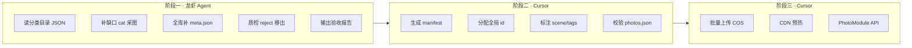

# 图库自动化采集规范

> **读者**：采集 Agent（龙虾）、后续 manifest/COS 脚本  
> **机读目录**：[图库分类目录.json](./图库分类目录.json)  
> **字段规范**：[图库分类与 manifest 规范](./图库分类与manifest规范.md)  
> **状态**：规范文档 · API 开发暂缓

---

## 1. 你的需求分析（三阶段流水线）

你要完成的不只是「多采几张图」，而是一条 **可自动执行、可验收、可交接** 的流水线：



| 阶段 | 执行者 | 输入 | 输出 | 你现在在哪 |
| ------ | ------ | ------ | ------ | ---------- |
| **一** | 龙虾 Agent | 本文 + `图库分类目录.json` | 本地图库完整 + 全 meta | **当前任务** |
| **二** | Cursor | 阶段一验收通过的图库 | `manifest/*.json` | 图库就绪后 |
| **三** | Cursor | manifest + COS 密钥 | CDN 可访问 `/photo` | API 开发期 |

**阶段一成功标准**：见 §8 验收清单。  
**不要**在阶段一未完成时上传 COS（缺 meta 无法生成 manifest）。

---

## 2. 本地图库审计（2026-07-03）

| 指标 | 数值 | 说明 |
| ------ | ------ | ------ |
| 已有 cat 目录 | **73** | `placeholder-images/{cat}/` |
| 图片总数 | **7502** | 主要为 `pexels_{id}.jpeg` |
| 已有 meta | **737** | `pexels_{id}_meta.json` |
| **meta 缺口** | **6765** | ⚠️ 90% 图片无元数据 |
| meta 完整 cat | **1** | 仅 `风景`（100/101） |
| meta 为零 cat | **2** | `动物`、`植物` |
| 待新建 cat | **7** | 见 §4.1 |
| 目标 cat 总数 | **80** | 73 + 7 |
| 目标图片总数 | **~8200** | 含补采 700 张 |

**结论**：图「量」基本够，**元数据和质量分类是最大缺口**；比再采 20 个细分类更重要。

---

## 3. 三层分类体系

### 3.1 层级定义

| 层级 | 字段 | 示例 | 谁用 |
| ------ | ------ | ------ | ------ |
| **cat** | 中文目录名 | `电商主图` | 磁盘目录、Pexels 检索、`?cat=` |
| **scene** | 英文 slug | `product` | Mock 映射、`?scene=` |
| **shot_type** | 构图类型 | `white-bg` | 采集筛选、accept/reject |

### 3.2 shot_type 说明（采集核心）

| shot_type | 中文 | 典型 UI 槽位 | 必须白底？ |
| ------ | ------ | ------ | ------ |
| `white-bg` | 白底单品 | 电商 SKU 主图、购物车缩略图 | **是** |
| `product-lifestyle` | 产品场景 | 3C 详情、服饰展示 | 否 |
| `food-plated` | 菜品特写 | 外卖列表、菜单 | 否 |
| `food-env` | 餐饮环境 | 门店页、团购头图 | 否 |
| `editorial` | 新闻报道 | 资讯 Feed cover | 否，要横图 |
| `portrait` | 人物肖像 | 用户主页、作者头像区 | 否 |
| `interior` | 室内空间 | 房产、酒店详情 | 否 |
| `landscape-wide` | 风景横幅 | Banner、封面 | 否，要横图 |
| `urban-wide` | 城市横幅 | 首页轮播 | 否，要横图 |
| `business` | 商务场景 | B 端 Landing | 否 |
| `texture` | 纹理背景 | 设计 Demo 背景 | — |
| `art-digital` | 风格化艺术 | 设计类展示 | — |

### 3.3 tier 分组（采集优先级）

| tier | 含义 | cat 数量 | mock_priority |
| ------ | ------ | ------ | ------ |
| **A-product** | 电商商品 | 17（含新增） | 1–2 |
| **B-food** | 餐饮 | 7 | 1–2 |
| **C-content** | 内容/社交 | 10 | 1–2 |
| **D-travel** | 出行/地理 | 14 | 1–2 |
| **E-vertical** | 垂直行业 | 12 | 1–2 |
| **F-decor** | 装饰/纹理 | 20 | **3**（不进 Mock 默认池） |

---

## 4. 缺口清单（按执行顺序）

### 4.1 新建 cat · 采图（700 张）

| 顺序 | cat | 张数 | shot_type | 优先级 | Pexels 主检索词 |
| ------ | ------ | ------ | ------ | ------ | ------ |
| 1 | **电商主图** | 100 | white-bg | P0 | `product white background` |
| 2 | **新闻** | 100 | editorial | P0 | `news editorial event` |
| 3 | **室内** | 100 | interior | P0 | `interior living room apartment` |
| 4 | **商务** | 100 | business | P1 | `business meeting handshake` |
| 5 | **餐饮门店** | 100 | food-env | P1 | `restaurant interior dining` |
| 6 | **美妆** | 100 | white-bg | P1 | `cosmetic product white skincare` |
| 7 | **母婴** | 100 | product-lifestyle | P1 | `baby product maternity` |

### 4.2 现有 cat · 不增图但必做

| 任务 | 范围 | 说明 |
| ------ | ------ | ------ |
| **meta 全库回填** | 7502 张 | 每张补 `pexels_{id}_meta.json` |
| **错类检测** | 全库 | 不符合 shot_type 的移入 `_rejected/` |
| **digital 组冻结** | 7 个 cat | 不再新增平板/手表等子类 |
| **banner 标注** | 风景/城市/国风 | 横图 16:9 加 tag `banner-candidate` |

### 4.3 明确不做

| 项 | 原因 |
| ---- | ------ |
| 平板 / 手表 / 相机 / 珠宝 等电商子类 | digital 组 + 电商主图已覆盖 |
| 再拆 手机 / 电脑 子子类 | 已有 100 张/cat，alias 合并即可 |
| 同步 Pexels API 给线上用户 | 仅离线批量采集 |

---

## 5. 逐类采集规格（摘要）

> 完整字段见 [图库分类目录.json](./图库分类目录.json)。  
> 下列为 **shot_type 硬性要求** 与 **accept/reject** 要点。

### 5.1 A-product 电商

| cat | shot_type | accept | reject |
| ------ | ------ | ------ | ------ |
| **电商主图** ⭐ | white-bg | 单品、白/纯色底、居中 | 多 SKU 堆叠、复杂背景 |
| **美妆** ⭐ | white-bg | 化妆品/护肤瓶罐 | 仅模特脸无产品 |
| **母婴** ⭐ | product-lifestyle | 婴儿用品、奶粉、纸尿裤 | 普通玩具 |
| 服装/鞋/包 | product-lifestyle | 单品可见 | 不当内容 |
| digital 组 ×7 | product-lifestyle | 设备主体清晰 | 严格白底（归电商主图） |
| 家电/玩具/礼物 | product-lifestyle | 产品为主体 | — |

**电商主图白底验收**：随机抽 20 张，≥ 14 张满足白/纯色底 + 单品。

### 5.2 B-food 餐饮

| cat | shot_type | 区分要点 |
| ------ | ------ | ------ |
| 美食/甜品/饮料/水果 | food-plated | 食物特写，非环境 |
| 咖啡 | food-plated | 杯子/拉花近景 |
| **餐饮门店** ⭐ | food-env | 店面/座位/就餐区，非菜品特写 |
| 咖啡馆 | food-env | 与「咖啡」特写互补 |

### 5.3 C-content 内容

| cat | shot_type | 区分要点 |
| ------ | ------ | ------ |
| **新闻** ⭐ | editorial | 横图；人物或事件；非纯风景 |
| 人物 | portrait | 肖像/半身；可 vertical Feed |
| 书籍/办公/办公桌 | office | 文档、书架、工位 |
| 运动/健身 | sport-action | 动作场景 |

### 5.4 D-travel / E-vertical

| cat | shot_type | 备注 |
| ------ | ------ | ------ |
| **室内** ⭐ | interior | 客厅/卧室/厨房均衡；非单件家具 |
| 家具 | product-lifestyle | 单件家具；全房间归「室内」 |
| 建筑/古建筑 | exterior-arch | 外观 |
| 医院 | medical | 可 tag `medical-staff` |
| **商务** ⭐ | business | 会议/握手；空工位归 office |

### 5.5 F-decor 装饰

- mock_priority 一律 **3**
- 不进 Mock 默认池；保留供 `?cat=` 浏览
- alias 组 `texture` / `nature-bg` 见 JSON

---

## 6. 龙虾 Agent 执行规范

### 6.1 路径约定

```text
{library_root}/
├── {cat}/pexels_{pexels_id}.jpeg
├── {cat}/pexels_{pexels_id}_meta.json
├── _rejected/{cat}/          # 质检失败移入
├── _reports/                 # 每轮 JSON 报告
└── manifest/                 # 阶段二生成，阶段一勿写
```

`library_root` 见 JSON：`/Users/mehaotian/Documents/workBuddyProject/image/placeholder-images`

### 6.2 单张 meta.json 模板

```json
{
  "pexels_id": 12345678,
  "category": "电商主图",
  "search_query": "product white background",
  "photographer": "Author Name",
  "photographer_url": "https://www.pexels.com/zh-cn/@author",
  "pexels_url": "https://www.pexels.com/zh-cn/photo/12345678/",
  "alt": "optional",
  "avg_color": "#F5F5F5",
  "width": 3000,
  "height": 3000,
  "shot_type": "white-bg",
  "orientation": "square",
  "aspect": "1:1",
  "scenes": ["product"],
  "alias_group": null,
  "mock_priority": 1,
  "tags": ["white-bg"],
  "downloaded_at": "2026-07-03 12:00:00"
}
```

**规则**：

- 每张 `.jpeg` 必须有同名 `_meta.json`
- `pexels_id` 与文件名一致
- `width`/`height` 最小边 ≥ 1200
- `orientation`：宽高比 >1.2 → landscape；<0.83 → portrait；否则 square

### 6.3 采集流程（每个 cat）

```text
1. 读 JSON categories[].status / priority
2. status=missing → 创建目录，按 pexels_queries 搜索下载至 100 张
3. status=ok_* → 跳过采图，仅补 meta
4. 每下载一张：写 meta + 校验 shot_type accept/reject
5. reject → 移到 _rejected/{cat}/，继续补满 100
6. 写 _reports/{cat}_{date}.json 汇总
```

### 6.4 Pexels 采集脚本

可基于现有 `download_pexels_v7.py` 扩展：

- `CATEGORIES` 改读 `图库分类目录.json`
- 下载后**必须**写 meta（v7 当前缺失此步）
- API Key 改环境变量 `PEXELS_API_KEY`，**勿提交 Git**
- 白底类参考 `ecommerce_test_search.py` 的多 query 策略

### 6.5 错类处理

| 情况 | 处理 |
| ---- | ------ |
| 美食目录出现室内餐厅 | 移到 `餐饮门店` 或 `_rejected` |
| 数码目录出现 strict 白底 | 移到 `电商主图` |
| 风景目录纯人物新闻 | 移到 `新闻` 或 `人物` |
| 无法判定 | `_rejected` + 报告人工复核 |

---

## 7. 阶段二交接标准（Cursor 负责）

龙虾完成阶段一后，交给 Cursor 的输入须满足：

| 检查项 | 标准 |
| ------ | ------ |
| cat 总数 | 80 目录存在 |
| 每 cat 图片 | 95–105 张 |
| meta 覆盖率 | **100%**（每张 jpeg 有 meta） |
| P0 cat | 电商主图/新闻/室内 各 ≥ 95 |
| 版权字段 | 100% 含 pexels_id + photographer |
| 报告 | `_reports/final_summary.json` |

Cursor 阶段二产出：

```text
manifest/photos.json       # 全局 id 1…8200
manifest/categories.json
manifest/scenes.json
```

阶段三产出：COS `assets/seed-pack/` + CDN URL。

---

## 8. 验收清单（阶段一 Done）

### 8.1 采图

- [ ] 7 个新 cat 目录已创建且各 ≥ 95 张
- [ ] 电商主图白底率 ≥ 70%（抽检）
- [ ] 新闻横图率 ≥ 60%
- [ ] 室内含客厅/卧室/厨房各 ≥ 20 张

### 8.2 元数据

- [ ] 8200 张图 meta 覆盖率 100%
- [ ] 动物、植物 meta 从 0 补全
- [ ] 每张含 shot_type / orientation / scenes / mock_priority

### 8.3 质量

- [ ] `_rejected/` 有清单且未计入 100 张配额
- [ ] digital 组无新增 cat
- [ ] 无重复 pexels_id（跨 cat 去重）

---

## 9. 给龙虾的一页 Prompt（可直接复制）

```text
你是 DevImage 图库采集 Agent。读取：
1. docs/图库自动化采集规范.md
2. docs/图库分类目录.json

工作目录：/Users/mehaotian/Documents/workBuddyProject/image/placeholder-images

任务顺序：
A. 创建 7 个缺失 cat 并各采 100 张（P0 先做：电商主图、新闻、室内）
B. 为全部 7502+ 现有 jpeg 补全 pexels_{id}_meta.json
C. 按 shot_type accept/reject 质检，错类移动或 reject
D. 输出 _reports/final_summary.json

约束：仅 Pexels；最小边 1200px；API Key 用环境变量；每张必须有 meta。
完成后停止，不要上传 COS（阶段二由 Cursor 处理）。
```

---

## 10. 相关文档

| 文档 | 说明 |
| ------ | ------ |
| [图库分类目录.json](./图库分类目录.json) | 机读 80 cat 全量规格 |
| [图库分类与 manifest 规范](./图库分类与manifest规范.md) | scene / COS / API 字段 |
| [占位与场景差异化规划](./占位与场景差异化规划.md) | 产品排期 |
