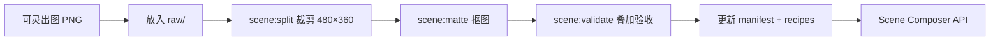

# 场景部件交付规范（可灵 AI → Scene Composer）

> **状态**：📋 **暂缓 · 二期 B** — 非功能补全一期。
> 可灵 AI 试产未达 Sprite 部件验收（风格锚点可参考，figures/props 格子不合格）。
> **一期**做骨架屏（纯程序）+ 占位 parity；**图库 `/photo` 为二期 A**（COS 未上传）。
>
> **用途**：用可灵 AI 或人工 Figma 批量交付 PNG 部件，经 Scene Composer 组装，
> 接入 `GET /scene/:variant/:seed`。
> **首个 style**：`devimg-scene`（flat vector 空状态插画，与头像 `devimage-cn` 视觉同族）。
> **相关**：[占位与场景差异化规划](./占位与场景差异化规划.md) · [头像美术资源规范](./头像美术资源规范.md)

---

## 0. 一期与二期的边界

| 能力 | 一期 | 二期（本文档） |
| ------ | ------ | -------------- |
| `GET /scene/:variant` 文案 SVG | ✅ 维持 + query 增强 | 升级为 Composer 输出 |
| `GET /skeleton/:w/:h` | ✅ 纯程序 | 可选 animate |
| figures / props PNG 部件 | ❌ 不做 | ✅ 验收通过后入库 |
| Scene Composer | ❌ 不开发 | ✅ 依赖部件库 |
| 可灵 / AI 批量出图 | ❌ 暂停 | ✅ 或改人工交付 |

**试产结论（2026-07）**：风格锚点（人+空盒 flat 紫调）**可用作参考**；
Sprite 格子存在 UI 框、水印、装饰粒子带偏等问题，**未达 §10 验收**，
故一期不继续投入 AI 出图。

---

## 1. 目标与范围

### 1.1 第二期 MVP（一期不实施）

> 以下规格为 **二期目标**，一期不创建 `packages/scene-assets/`、不跑裁剪脚本。

| 项目 | 规格 |
| ------ | ------ |
| 风格 ID | `devimg-scene` |
| 部件画布 | **480 × 360 px**（4:3，插画安全区） |
| 部件槽位 | `figures` → `props`（`background` / 文案由代码生成） |
| figures 数量 | MVP **16** 格（4×4）；验证通过后扩至 **64**（8×8） |
| props 数量 | MVP **24** 格（4×6 或 6×4）；扩至 **48+** |
| 理论组合数 | 16 × 24 = **384**（扩至 64 × 48 = **3072**） |
| 输出 | PNG 透明底 → Composer 嵌入 SVG |
| API | `GET /scene/:variant/:seed` |

### 1.2 不在第一期做

- 固定整图场景（每 variant 一张完整插画）
- 实时 AI 生成（仅离线批量出图）
- 精细叙事插画（多人、透视室内）
- `accents` PNG 槽位（第一期用代码绘制省略号、问号等）

### 1.3 与头像部件的差异

| 维度 | 头像 `devimage-cn` | 场景 `devimg-scene` |
| ------ | ------------------- | ------------------- |
| 画布 | 512 × 512 正方形 | **480 × 360** 横版 |
| 视角 | 正脸 | **侧面/背面剪影**，无五官细节 |
| 槽位 | faces + features + hair | **figures + props** |
| 背景 | 代码圆形/渐变 | 代码 mesh/渐变 + 可选 quiet zone |
| 文案 | 无（或首字 overlay） | **代码渲染** title / subtitle |

---

## 2. 目录结构

```text
packages/scene-assets/
├── package.json
├── manifest/
│   ├── devimg-scene.schema.json
│   └── devimg-scene.json
├── assets/devimg-scene/
│   ├── style-anchor.png           # 风格锚点（可灵参考图）
│   ├── raw/                       # 原始 Sprite（建议 .gitignore）
│   │   ├── figures-4x4.png
│   │   └── props-empty-4x6.png
│   ├── figures/                   # 001.png …
│   └── props/                     # 001.png …
├── recipes/
│   └── variant-props.json         # variant → 可用 prop id 列表
└── scripts/
    ├── split-sprite-sheet.mjs     # 可复用 avatar 脚本，默认 cell 480×360
    ├── remove-white-bg.mjs
    └── validate-scene-composite.mjs
```

根目录快捷命令（接入 `package.json` 后）：

```bash
pnpm scene:split -- \
  --input assets/devimg-scene/raw/figures-4x4.png \
  --slot figures --cols 4 --cell-w 480 --cell-h 360
pnpm scene:matte -- --dir assets/devimg-scene/figures
pnpm scene:validate -- --style devimg-scene --variant empty --samples 20
```

---

## 3. 画布锚点（所有部件必须对齐）

在 Figma / PS 中建立 **480×360** 模板；AI 出图后裁剪脚本按格对齐。
允许 **±6 px** 误差，超出需重跑该格。

| 锚点 | 坐标 (x, y) | 说明 |
| ------ | ------------- | ------ |
| 画布中心 | (240, 180) | 全局参考 |
| **地面线** | y = **300** | `figures` 脚底对齐 |
| 人物中心 | (240, 250) | 躯干参考 |
| **道具中心** | (240, 210) | `props` 主视觉中心 |
| 插画安全区 | 416 × 296，居中 | 内容不应超出 |
| 边距 | 距四边 ≥ 32 px | 防止窄屏裁切 |

```text
y=32  ─────────────────────────────  上边距
      │                               │
      │         [ props 区 ]          │  y≈210 道具中心
      │         [ figures ]           │  y≈250 人物中心
y=300 ═══════════════════════════════  地面线
y=360 ─────────────────────────────  下边距
              480 × 360
```

### 3.1 叠层顺序（z-index 从低到高）

```text
1. background（代码：mesh / gradient，由 seed + theme 生成）
2. figures/{id}.png          # 人物剪影，在道具后方或侧方
3. props/{id}.png            # 主视觉道具（盒子、放大镜等）
4. accents（代码：虚线、小问号、装饰圆点）
5. copy（代码：title + subtitle 文本层）
```

**原则**：figures 与 props **内容互斥**——每张 PNG 只含本 slot 约定元素，透明底。

---

## 4. 各 slot「能画 / 不能画」

### 4.1 `figures`（人物剪影层）

| 必须包含 | 必须不包含 |
| ---------- | ------------ |
| 简化人形剪影（侧面或 3/4 背） | 五官细节、写实面部 |
| 统一线宽 flat vector | 道具、场景背景 |
| 脚底对齐地面线 y=300 | 文字、阴影投到背景 |

### 4.2 `props`（道具层）

| 必须包含 | 必须不包含 |
| ---------- | ------------ |
| **单个**道具主视觉 | 人物、第二道具 |
| 居中对齐道具中心 (240,210) | 地面、地平线、室内场景 |
| 与 variant 语义相关（见 §6） | 文字、UI 截图 |

### 4.3 代码层（不由 AI 交付）

| 层 | 说明 |
| ---- | ------ |
| background | `seed` → HSL palette → mesh/gradient |
| accents | 省略号、问号、虚线框 |
| copy | variant 默认中文 + `?title=` 覆盖 |

---

## 5. Style Bible（复制到每条可灵提示词末尾）

```text
【技术规范 - 必须严格遵守】
- 2D flat vector illustration，mobile app empty state 风格，非写实、非 3D
- 单物体/单角色占格子 85%，居中对齐
- 画布比例 4:3 横版（480×360 逻辑比例）
- 纯白色背景 #FFFFFF，无渐变、无场景环境、无地面阴影投射到背景
- 线条粗细统一 2px，圆角风格，色块平涂 minimal shading
- 配色柔和，与 DevImage 头像 devimage-cn 同族（蓝紫 / 中性灰点缀）
- 无文字、无水印、无 logo、无格子间重叠
- 网格等分，每格一个独立部件
- 适合开发者文档占位 empty state，温和友好
```

### 5.1 通用负面提示词

```text
realistic, 3D, photo, detailed face, eyes, mouth, gradient background,
shadow on background, text, watermark, logo, border frame,
multiple objects in one cell, overlapping cells, blurry,
full scene, room interior, landscape background
```

---

## 6. 可灵 AI 分批次提示词

> **流程**：生成 `style-anchor.png` → 每批次上传为「风格参考」→ 跑 Sprite Sheet → 裁剪抠图。

### 6.1 风格锚点（生成 1 次，选 1 张）

```text
单张 mobile app empty state illustration，2D flat vector，
一人侧面剪影看向空盒子，柔和蓝紫色系，极简几何道具，
纯白色背景，无文字，风格类似 Notion / 飞书空状态插画

【技术规范 - 必须严格遵守】
（粘贴第 5 节 Style Bible）
```

保存至 `packages/scene-assets/assets/devimg-scene/style-anchor.png`。

### 6.2 人物库 `figures`（4×4 MVP，仅剪影）

```text
Empty state character sprite sheet，4 rows × 4 columns，共 16 个不同人物剪影，
每个格子一个独立角色：侧面或背面、无五官细节、统一身高，
只有简化人形轮廓，NO props，NO objects，NO background scene，
所有角色脚底对齐格子底部同一水平线，2D flat vector，纯白色背景 #FFFFFF

严格参考附件风格锚点的线条粗细和配色

【技术规范 - 必须严格遵守】
（Style Bible）
```

扩量时改为 8×8（64 格），提示词中行列数同步修改。

### 6.3 道具库 `props`（分批出图）

道具按 **语义批次** 出图，避免一张 Sheet 塞入差异过大的物体导致风格漂移。

#### 批次 A：通用空状态（4×6 = 24）

```text
Empty state props sprite sheet，4 rows × 6 columns，24 个不同道具，
每个格子 ONLY 一个道具：空 cardboard box、open folder、empty tray、
empty inbox、blank document、empty list clipboard 等，
无人物、无背景、无文字，道具居中，2D flat vector，纯白色背景

严格匹配附件风格锚点的线条与配色

【技术规范 - 必须严格遵守】
（Style Bible）
```

#### 批次 B：404 / 网络 / 搜索（后续扩展）

| 批次 | 道具示例 | 对应 variant |
| ------ | ---------- | -------------- |
| B1 | 断链、迷路牌、问号路标、空地图 | `404` |
| B2 | WiFi 斜杠、断线、信号塔、离线云 | `network` |
| B3 | 放大镜、空搜索结果、过滤漏斗 | `search` |
| B4 | 空购物车、空气泡、锁、扳手 | `cart` `message` `permission` `maintenance` |

每批次独立 Sprite，裁剪后 **追加** manifest `props.count`，编号连续。

---

## 7. Variant Recipe 与 prop 映射

文件：`packages/scene-assets/recipes/variant-props.json`

| variant | 可用 prop id 范围（示例） | 默认 title |
| --------- | --------------------------- | ------------ |
| `404` | 101–106（断链类） | 页面不存在 |
| `empty` | 001–012（空容器类） | 暂无数据 |
| `network` | 201–206 | 网络异常 |
| `search` | 301–306 | 无搜索结果 |
| `cart` | 401–404 | 购物车是空的 |
| `message` | 501–504 | 暂无消息 |
| `permission` | 601–604 | 暂无权限 |
| `maintenance` | 701–704 | 系统维护中 |

**选件规则**（程序实现）：

```text
seed + variant + slot → FNV hash → index % pool.length → 部件 id
```

同一 `seed` + 同 `variant` → 永远相同 figure + prop 组合。

---

## 8. 后期处理流水线



| 步骤 | 命令 | 产出 |
| ------ | ------ | ------ |
| 1. 裁剪 | `pnpm scene:split` | `figures/001.png` … |
| 2. 抠图 | `pnpm scene:matte` | 透明底 PNG |
| 3. 验收 | `pnpm scene:validate` | `out/scene-{variant}-{seed}.png` |
| 4. 登记 | 编辑 manifest + recipes | count 与文件数一致 |

### 8.1 命名规则

- 文件名：三位数字 `001.png` … `064.png`
- 索引从 **1** 开始
- slot 名：`figures` \| `props`

### 8.2 Git 与 COS

- `raw/` 原始大图建议 `.gitignore`
- 裁剪后 PNG 可提交 Git，或上传 COS，`manifest.basePath` 指向 CDN
- 单张建议 < 120KB（480×360 透明 PNG）

---

## 9. Manifest 规范

正式文件：`packages/scene-assets/manifest/devimg-scene.json`

| 字段 | 类型 | 必填 | 说明 |
| ------ | ------ | ------ | ------ |
| `style` | string | 是 | `devimg-scene` |
| `version` | string | 是 | semver |
| `canvas` | object | 是 | `{ width: 480, height: 360 }` |
| `anchors` | object | 是 | groundLine, propCenter, figureCenter |
| `slots` | array | 是 | `[{ name, count, path }]` |
| `basePath` | string | 否 | COS/CDN 前缀 |
| `recipesPath` | string | 是 | variant-props.json 相对路径 |

示例：

```json
{
  "style": "devimg-scene",
  "version": "1.0.0",
  "canvas": { "width": 480, "height": 360 },
  "anchors": {
    "groundLine": 300,
    "propCenter": [240, 210],
    "figureCenter": [240, 250]
  },
  "slots": [
    { "name": "figures", "count": 16, "path": "figures" },
    { "name": "props", "count": 24, "path": "props" }
  ],
  "recipesPath": "recipes/variant-props.json"
}
```

---

## 10. 组合验收

### 10.1 通过标准

| # | 检查项 | 通过条件 |
| --- | -------- | ---------- |
| 1 | 地面线 | figures 脚底落在 y=300 ±6px |
| 2 | 道具不与人重叠混乱 | prop 与 figure 可重叠但无「切肢」感 |
| 3 | 透明底 | 无白边、无半透明白晕 |
| 4 | 风格一致 | 20 组随机 seed 线宽/配色同族 |
| 5 | 随机 20 组 | **≥ 18 组** 可接受 |

### 10.2 工程验收

```bash
pnpm scene:validate -- --style devimg-scene --variant empty --samples 20
```

输出：`packages/scene-assets/out/validate/`。

### 10.3 API 验收

- [ ] `GET /scene/empty/demo` 与 `/scene/empty/demo` 二次请求字节一致
- [ ] 换 seed 后 figure 或 prop 至少一项变化
- [ ] `?theme=dark` 背景可读，部件对比度合格
- [ ] 375×812 与 800×600 无溢出

---

## 11. 导出规范

| 项 | 要求 |
| ---- | ------ |
| 单文件尺寸 | **480 × 360 px**（固定） |
| 格式 | PNG-24，Alpha 通道 |
| 背景 | 全透明 |
| 色彩 | sRGB |
| 禁止 | 最小包围盒导出、JPG、带背景整图 |

---

## 12. 版权与合规

- 可灵出图需确认 **商业授权** 可用于 CDN 分发
- 禁止可识别真人、未授权 IP、品牌 logo
- 文档注明：场景图为 **开发占位**，非正式产品设计稿

---

## 13. 与程序的对应关系

```text
GET /scene/:variant/:seed
  → 读 recipes[variant] 得 prop 池
  → figures: hash(seed, "figures") % 16
  → props:   hash(seed, "props")   % pool.length → 映射 prop id
  → 代码生成 background + accents + copy
  → composite → SVG（可选 .webp 栅格）
```

背景、文案不写入 PNG 部件（never embed copy in parts）；便于 theme 切换与 i18n 扩展。
