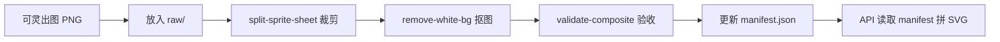

# 头像美术资源规范（可灵 AI → DevImage 拼接）

> **用途**：第一期用可灵 AI 生成 Sprite Sheet，裁剪为 PNG 部件，经 seed 确定性组合，
> 接入 `GET /avatar/:style/:seed/:size`。  
> **首个 style**：`devimage-cn`（东亚卡通 flat vector，国内开发者占位头像）。

---

## 1. 目标与范围

### 1.1 第一期 MVP

| 项目 | 规格 |
| ------ | ------ |
| 风格 ID | `devimage-cn` |
| 画布 | 512 × 512 px，viewBox 固定 |
| 部件层 | 脸型 → 五官 → 头发（背景圆由代码生成） |
| 每类数量 | MVP 16 格/类；验证通过后扩至 64 格（8×8） |
| 理论组合数 | 16³ = 4096（扩至 64³ = 262144） |
| 输出格式 | PNG（透明底）→ API 嵌进 SVG |
| API 路由 | `GET /avatar/devimage-cn/:seed/:size` |

### 1.2 不在第一期做

- 自研 SVG 矢量部件（留第二期）
- 实时 AI 生成（仅离线批量出图）
- 64 类以上部件槽位（鼻/耳/配饰等）

---

## 2. 目录结构

仓库内资源与脚本位于 `packages/avatar-assets/`：

```text
packages/avatar-assets/
├── package.json
├── manifest/
│   ├── devimage-cn.schema.json    # JSON Schema
│   └── devimage-cn.json           # 正式 manifest（接 API）
├── assets/devimage-cn/
│   ├── style-anchor.png           # 风格锚点（可灵参考图）
│   ├── raw/                       # 可灵原始大图（建议不入 Git）
│   │   ├── faces-8x8.png
│   │   ├── features-8x8.png
│   │   └── hair-8x8.png
│   ├── faces/                     # 裁剪后 001.png …
│   ├── features/
│   └── hair/
└── scripts/
    ├── split-sprite-sheet.mjs     # 网格裁剪 + 缩放到 512
    ├── remove-white-bg.mjs        # 白底转透明
    └── validate-composite.mjs     # 随机组合验收图
```

根目录快捷命令（接入 `package.json` 后）：

```bash
pnpm avatar:split -- \
  --input assets/devimage-cn/raw/faces-8x8.png --slot faces --cols 8
pnpm avatar:matte -- --dir assets/devimage-cn/faces
pnpm avatar:validate -- --style devimage-cn --samples 10
```

---

## 3. 画布锚点（所有部件必须对齐）

在 Figma / PS 中建立 **512×512** 模板，所有 PNG 导出时内容对齐到下列锚点（允许 ±4px 误差，超出需重跑该格）：

| 锚点 | 坐标 (x, y) | 说明 |
| ------ | ------------- | ------ |
| 画布中心 | (256, 256) | viewBox 原点对齐 |
| 头部中心 | (256, 260) | 脸型椭圆中心 |
| 双眼连线中心 | (256, 220) | 五官层对齐基准 |
| 鼻尖 | (256, 250) | 验收用 |
| 嘴巴中心 | (256, 285) | 验收用 |
| 发际线中心 | (256, 145) | 头发层顶部对齐 |
| 脸椭圆参考 | 宽 200 × 高 240 | 以 (256,260) 为中心 |

叠层顺序（z-index 从小到大）：

```text
1. 背景圆（代码 hsl(seed) 生成，不用 AI）
2. faces/{id}.png
3. features/{id}.png
4. hair/{id}.png
```

---

## 4. Style Bible（复制到每条可灵提示词末尾）

以下段落**原样粘贴**到每次生成请求的提示词中，保证系列一致：

```text
【技术规范 - 必须严格遵守】
- 2D flat vector illustration，类似 mobile app avatar icon，非写实、非 3D
- 正脸 front view，头部无旋转，无侧脸，无倾斜
- 单角色占格子 90%，居中，头顶距格子上边 8%，下巴距格子下边 12%
- 画布比例 1:1 正方形
- 纯白色背景 #FFFFFF，无渐变、无场景、无阴影投射到背景
- 线条粗细统一 2px，圆角风格，色块平涂 minimal shading
- 东亚卡通风格，温和友好，适合开发者文档占位头像
- 无文字、无水印、无 logo、无格子间重叠
- 8 行 8 列清晰等分网格，每格一个独立部件
```

### 4.1 通用负面提示词

```text
realistic, 3D, photo, side view, tilted head, gradient background,
shadow on background, text, watermark, logo, border frame,
multiple characters in one cell, overlapping cells, blurry
```

---

## 5. 可灵 AI 分批次提示词

> **流程**：先生成 `style-anchor.png` → 每批次上传为「风格/角色参考」→ 再跑 Sprite Sheet。

### 5.1 风格锚点（生成 1 次，选 1 张）

```text
单张 mobile app 用户头像，2D flat vector illustration，东亚卡通正脸，
圆形脸、温和表情、中性五官、短发，平涂色块，线条 2px，
纯白色背景，无头发遮挡额头，无配饰，无文字，
风格简洁现代，类似 Notion / 飞书默认头像

【技术规范 - 必须严格遵守】
（粘贴第 4 节 Style Bible）
```

保存至 `packages/avatar-assets/assets/devimage-cn/style-anchor.png`。

### 5.2 脸型库 `faces`（8×8，无发无五官）

```text
Character design sprite sheet，8 rows × 8 columns，共 64 个不同脸型，
每个格子一个独立的脸型轮廓 + 耳朵 + 统一中性肤色 #F5D0C5，
只有脸和耳朵， absolutely NO hair，NO eyes，NO nose，NO mouth，NO eyebrows，
脸型变化：圆脸、方脸、鹅蛋脸、略宽脸、略长脸、微方下巴等，
所有脸型尺寸一致、正脸、居中对齐、同一视角，
2D flat vector illustration，平涂，纯白色背景 #FFFFFF

严格参考附件风格锚点的线条粗细和配色方式

【技术规范 - 必须严格遵守】
（Style Bible）
```

### 5.3 五官库 `features`（8×8，仅眼鼻嘴）

```text
Character facial features sprite sheet，8×8 grid，64 种不同五官组合，
每个格子 ONLY：两只眼睛 + 鼻子 + 嘴巴（可含简单眉毛），
无脸型轮廓、无耳朵、无头发、无皮肤填充，
五官大小一致，双眼间距一致，适合叠加在标准正脸模板上，
表情温和中性，2D flat vector，纯白色背景，居中对齐

严格匹配附件风格锚点的五官画法

【技术规范 - 必须严格遵守】
（Style Bible）
```

若 AI 总画出完整脸部，加强：

```text
transparent face area, only floating facial features, sticker sheet for overlay
```

### 5.4 头发库 `hair`（8×8，无脸）

```text
Hairstyle sprite sheet for avatar builder，8×8 grid，64 种不同发型，
每个格子 ONLY 头发（含刘海），无脸、无五官、无耳朵，
发型：短发、长发、马尾、丸子头、寸头、偏分、卷发、直发等，
所有发型顶部对齐同一高度，适合覆盖在标准脸型上，
2D flat vector，平涂，纯白色背景

严格匹配附件风格锚点的线条与发色饱和度

【技术规范 - 必须严格遵守】
（Style Bible）
```

---

## 6. 后期处理流水线



### 6.1 步骤说明

| 步骤 | 命令 | 产出 |
| ------ | ------ | ------ |
| 1. 裁剪 | `pnpm avatar:split` | `faces/001.png` … `064.png` |
| 2. 抠图 | `pnpm avatar:matte` | 透明底 PNG |
| 3. 验收 | `pnpm avatar:validate` | `out/composite-*.png` 预览 |
| 4. 登记 | 编辑 `manifest/devimage-cn.json` | `count` 与文件数一致 |

### 6.2 命名规则

- 文件名：三位数字 `001.png` … `064.png`（不足三位补零）
- 索引从 **1** 开始（与 seed 取模 +1 对应）
- 仅小写 slot 名：`faces` \| `features` \| `hair`

### 6.3 Git 与体积

- `assets/devimage-cn/raw/` 原始大图建议加入 `.gitignore`（本地保留）
- 裁剪后的 `faces/`、`features/`、`hair/` 可提交（单张约 20–80KB）
- 或使用 COS 存放，manifest 中 `basePath` 指向 CDN

---

## 7. Manifest 规范

正式文件：`packages/avatar-assets/manifest/devimage-cn.json`  
Schema：`packages/avatar-assets/manifest/devimage-cn.schema.json`

### 7.1 字段说明

| 字段 | 类型 | 必填 | 说明 |
| ------ | ------ | ------ | ------ |
| `style` | string | 是 | 路由中的 style，如 `devimage-cn` |
| `version` | string | 是 | semver，资源变更时递增 |
| `canvas` | number | 是 | 画布边长，固定 `512` |
| `basePath` | string | 是 | 相对 manifest 的资源根，或 CDN URL 前缀 |
| `background` | object | 是 | 背景圆配置（代码生成） |
| `layers` | array | 是 | 按 z-index 升序排列 |
| `layers[].slot` | string | 是 | 槽位名，对应目录名 |
| `layers[].z` | number | 是 | 叠层顺序 |
| `layers[].count` | number | 是 | 该槽位 PNG 数量 |
| `layers[].path` | string | 是 | 路径模板，`{id}` 替换为三位编号 |
| `layers[].optional` | boolean | 否 | 默认 false；true 时 seed 可跳过该层 |
| `seed` | object | 是 | 确定性索引算法说明 |

### 7.2 示例 manifest

```json
{
  "style": "devimage-cn",
  "version": "1.0.0",
  "canvas": 512,
  "basePath": "../assets/devimage-cn",
  "background": {
    "type": "circle",
    "fromSeed": "hue",
    "saturation": 55,
    "lightness": 55
  },
  "layers": [
    {
      "slot": "faces",
      "z": 1,
      "count": 16,
      "path": "faces/{id}.png"
    },
    {
      "slot": "features",
      "z": 2,
      "count": 16,
      "path": "features/{id}.png"
    },
    {
      "slot": "hair",
      "z": 3,
      "count": 16,
      "path": "hair/{id}.png"
    }
  ],
  "seed": {
    "algorithm": "fnv1a-mod",
    "slots": ["faces", "features", "hair"]
  }
}
```

### 7.3 Seed → 部件索引

与 `apps/api/src/common/utils.ts` 中 `seedToHue` 同源思路：对 `seed + slot名` 做哈希后取模。

```text
index(slot) = (fnv1a(seed + ":" + slot) % count) + 1
```

同一 `seed` 永远得到同一组合；`Cache-Control: immutable`（见竞品 URL 对照表）。

---

## 8. 验收标准

### 8.1 单格验收

- 尺寸 512×512
- 透明底（或抠图后无白边）
- 部件类型正确（头发格无五官等）

### 8.2 组合验收

运行 `pnpm avatar:validate -- --samples 10`，人工检查：

| 检查项 | 通过标准 |
| ------ | ---------- |
| 五官位置 | 眼在脸内，鼻嘴居中 |
| 头发衔接 | 刘海覆盖发际线，不挡眼睛 |
| 风格一致 | 10 组中 ≥ 8 组无明显违和 |
| 边缘 | 无白晕、无锯齿过重 |

不通过：仅重跑对应 Sprite Sheet 批次，不必重做全部。

### 8.3 降级方案

若 `features` 层对齐失败率 > 30%：

- 改为 **「脸+五官一体」** 64 格，只与 `hair` 组合
- manifest 减少一层，`layers` 仅 `faces-full` + `hair`

---

## 9. API 接入要点（开发参考）

路由注册顺序：

```text
GET /avatar/styles                      → 风格列表 JSON
GET /avatar/:style/:seed/:size          → 多风格 SVG（含 devimg-initials）
```

SVG 结构示意：

```xml
<svg xmlns="http://www.w3.org/2000/svg"
  width="{size}" height="{size}" viewBox="0 0 512 512">
  <circle cx="256" cy="256" r="256" fill="#{bgFromSeed}"/>
  <image href="faces/007.png" x="0" y="0" width="512" height="512"/>
  <image href="features/023.png" ... />
  <image href="hair/041.png" ... />
</svg>
```

生产环境可将 PNG 内联为 base64 或走 COS + CDN URL（避免相对路径失效）。

---

## 10. 生成排期建议

| 天数 | 任务 |
| ------ | ------ |
| D1 | 生成 3 张 style-anchor，定稿 1 张 |
| D2 | 跑 `faces` 8×8 → split + matte |
| D3 | 跑 `hair` 8×8 → 与 5 个脸型试拼 |
| D4 | 跑 `features` 8×8；失败则改脸+五官一体 |
| D5 | validate 10 组 + 更新 manifest |
| D6 | 接入 NestJS `AvatarService` 多风格分支 |

---

## 11. 相关文档

- [竞品 URL 与 API 对照表](./竞品URL与API对照表.md) — DiceBear 迁移路径
- [完整开发文档 §5.2](./完整开发文档.md) — 头像 API 规划
- [竞品站](./竞品站.md) — DiceBear 参考
