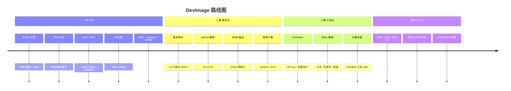

# DevImage 完整开发文档

> 国内开发者占位资源 CDN · 功能规格 · 参数属性 · 分期规划  
> 基准域名：`https://cdn.devimage.cn` · 文档站：`https://devimage.cn`  
> 最后更新：2026-07

---

## 1. 文档说明

| 文档 | 用途 |
| ------ | ------ |
| **本文档** | 功能全集、参数属性、分期规划、实现状态 |
| [MVP功能优先级PRD](./MVP功能优先级PRD.md) | 2 周执行排期 |
| [竞品URL与API对照表](./竞品URL与API对照表.md) | 与 picsum/placehold 迁移对照 |
| [腾讯云COS部署指南](./腾讯云COS部署指南.md) | 生产部署 |
| [Freemium定价与成本模型](./Freemium定价与成本模型.md) | 商业化 |
| [apps/docs/](../apps/docs/) | 面向用户的 API 文档站 |

### 状态图例

| 标记 | 含义 |
| ------ | ------ |
| ✅ | 已实现 |
| 🚧 | 部分实现 |
| 📋 | 已规划，未开发 |
| 🔮 | 远期（平台化） |

---

## 2. 产品定位

**一句话**：国内开发者的零配置占位 CDN — 复制 URL 即可用于 ``、`fetch()`，替代 picsum 国内慢的问题。

**长期愿景**：Developer Assets Platform（占位图 → Mock → 图标/Lottie/音效 → 统一 CDN）

---

## 3. 分期总览



### 分期对照表

| 阶段 | 时间目标 | 核心交付 | 不做 |
| ------ | ---------- | ---------- | ------ |
| **一期** | 2 周 | 合成图、头像、Mock、场景、文档、腾讯云部署 | 真实照片、付费、Pexels 实时 |
| **二期** | +2–4 周 | `/photo`、COS、picsum 兼容、WebP | 用户系统、自定义 Mock |
| **三期** | +1–2 月 | API Key、Freemium、Mock 完整 REST | 图标/Lottie |
| **四期** | 长期 | 多资源类型统一平台 | — |

---

## 4. 全局约定

### 4.1 URL 设计原则

- **图片 CDN 路径不加 `/v1`**（与 picsum 一致，URL 长期稳定）
- **管理类接口**（OpenAPI、未来控制台）可使用 `/v1`
- Path 参数用 `/` 分隔；placehold 风格 `800x600` 为**二期**可选别名

### 4.2 通用参数约束

| 约束项 | 规则 |
| -------- | ------ |
| 宽度 / 高度 | 整数，`10` ~ `4000` |
| 颜色 `bg` / `fg` | hex，3 位或 6 位，**不含 `#`** |
| 文字 `text` | 最长 **50** 字符，SVG 转义 |
| 名称 `name` | URL 编码，支持中文 |
| Mock `count` | 1 ~ **100**，默认 10 |
| Mock `id` | 1 ~ **100** |

### 4.3 参数别名（二期支持）

| 主参数 | 兼容别名 |
| -------- | ---------- |
| `bg` | `bc`, `bgColor` |
| `fg` | `tc`, `textColor` |
| `text` | `t` |
| `w` / `h`（query） | `width` / `height` |

### 4.4 响应头规范

| 资源类型 | Content-Type | Cache-Control |
| ---------- | -------------- | --------------- |
| 随机合成图 | `image/svg+xml; charset=utf-8` | `public, max-age=3600` |
| seed / 头像 | `image/svg+xml; charset=utf-8` | `public, max-age=31536000, immutable` |
| 场景图 | `image/svg+xml; charset=utf-8` | `public, max-age=86400` |
| 真实照片 | `image/webp` | `public, max-age=31536000, immutable` |
| Mock JSON | `application/json; charset=utf-8` | `public, max-age=300` |

### 4.5 错误响应

| HTTP | 场景 | 响应体 |
| ------ | ------ | -------- |
| `400` | 尺寸/颜色/variant 非法 | JSON `{ statusCode, message }` |
| `404` | Mock id 不存在 | JSON `{ statusCode, message }` |
| `429` | 超过限流 | JSON（Throttler 默认） |

### 4.6 限流（一期）

| 项 | 值 |
| ---- | ----- |
| 策略 | 全局限流 `@nestjs/throttler` |
| 额度 | **100 次 / 分钟 / IP** |
| 二期 | `/photo` 单独更低配额 |

### 4.7 CORS

```http
Access-Control-Allow-Origin: *
```

---

## 5. 功能模块详解

---

### 5.1 合成占位图（Placeholder）

**用途**：替代 placehold.co / 纯色块占位，国内毫秒级 SVG。

#### 5.1.1 `GET /:width/:height`

| 属性 | 说明 |
| ------ | ------ |
| **分期** | 一期 ✅ |
| **状态** | ✅ 已实现 |
| **方法** | GET |
| **响应** | SVG 图片 |

##### 5.1.1 Path 参数

| 参数 | 类型 | 必填 | 约束 | 说明 |
| ------ | ------ | ------ | ------ | ------ |
| `width` | number | 是 | 10–4000 | 图片宽度（path 段 `:w`） |
| `height` | number | 是 | 10–4000 | 图片高度（path 段 `:h`） |

##### 5.1.1 Query 参数

| 参数 | 类型 | 必填 | 默认 | 说明 |
| ------ | ------ | ------ | ------ | ------ |
| `text` | string | 否 | `{width}×{height}` | 显示文字 |
| `bg` | string | 否 | 随机灰 `#cccccc` | 背景色 hex |
| `fg` | string | 否 | `#666666` | 文字色 hex |

##### 5.1.1 行为

- 无 seed：每次请求背景色**随机**（HSL 随机 hue）
- 有 `bg`/`fg` 时忽略随机色

##### 5.1.1 示例

```html


```

---

#### 5.1.2 `GET /seed/:seed/:width/:height`

| 属性 | 说明 |
| ------ | ------ |
| **分期** | 一期 ✅ |
| **状态** | ✅ 已实现 |
| **方法** | GET |
| **响应** | SVG 图片（确定性） |

##### 5.1.2 Path 参数

| 参数 | 类型 | 必填 | 说明 |
| ------ | ------ | ------ | ------ |
| `seed` | string | 是 | 任意字符串，决定配色与表现 |
| `width` | number | 是 | 10–4000 |
| `height` | number | 是 | 10–4000 |

##### 5.1.2 Query 参数

| 参数 | 类型 | 必填 | 默认 | 说明 |
| ------ | ------ | ------ | ------ | ------ |
| `text` | string | 否 | `{width}×{height}` | 显示文字 |
| `bg` | string | 否 | 由 seed 推导 | 背景色 |
| `fg` | string | 否 | 由 seed 推导 | 文字色 |

##### 5.1.2 行为

- 相同 `seed` + 相同尺寸 → **永远相同**配色（基于 seed hash → HSL）

##### 5.1.2 示例

```html

```

---

#### 5.1.3 格式与扩展（规划中）

| 功能 | 路由/参数 | 分期 | 状态 |
| ------ | ----------- | ------ | ------ |
| SVG 后缀 | `/800/600.svg` | 一期 | 📋 |
| WebP 输出 | `/800/600.webp` 或 `?format=webp` | 二期 | 📋 |
| PNG 输出 | `.png` | 三期 | 📋 |
| 边框 | `?border=1&borderColor=000` | 二期 | 📋 |
| 叉号标记 | `?cross=1` | 二期 | 📋 |
| placehold 别名 | `/800x600` | 二期 | 📋 |
| query 尺寸 | `?width=800&height=600` | 二期 | 📋 |
| 灰度 / 模糊 | `?grayscale=1&blur=2` | 二期（photo 用） | 📋 |

---

### 5.2 头像占位（Avatar）

**用途**：替代 DiceBear / UI Avatars，支持中文首字。

#### 5.2.1 `GET /avatar/:name/:size`

| 属性 | 说明 |
| ------ | ------ |
| **分期** | 一期 ✅ |
| **状态** | ✅ 已实现 |
| **方法** | GET |
| **响应** | SVG 圆形头像 |

##### 5.2.1 Path 参数

| 参数 | 类型 | 必填 | 约束 | 说明 |
| ------ | ------ | ------ | ------ | ------ |
| `name` | string | 是 | URL 编码 | 用户名或昵称 |
| `size` | number | 是 | 10–4000 | 正方形边长（px） |

##### 5.2.1 Query 参数

| 参数 | 类型 | 必填 | 默认 | 说明 |
| ------ | ------ | ------ | ------ | ------ |
| `bg` | string | 否 | 由 name hash 推导 | 圆形背景色 |
| `fg` | string | 否 | `ffffff` | 文字色 |

##### 5.2.1 行为

| 输入 | 显示字符 |
| ------ | ---------- |
| 中文名 `张三` | `张` |
| 英文名 `John` | `J` |
| 空字符串 | `?` |

##### 5.2.1 示例

```html


```

---

#### 5.2.2 头像扩展（规划中）

| 功能 | 路由 | 分期 | 状态 |
| ------ | ------ | ------ | ------ |
| 多风格 | `/avatar/:style/:name/:size` | 三期 | 📋 |
| initials 模式 | `?mode=initials`（多词取首字母） | 二期 | 📋 |
| Raster 输出 | `.png` / `.webp` | 二期 | 📋 |
| 圆角矩形 | `?shape=rounded` | 三期 | 📋 |

---

### 5.3 场景占位图（Scene）

**用途**：404、空状态、网络错误等 UI 场景插画占位。

#### 5.3.1 `GET /scene/:variant`

| 属性 | 说明 |
| ------ | ------ |
| **分期** | 一期 ✅ |
| **状态** | ✅ 已实现 |
| **方法** | GET |
| **响应** | SVG 场景图 |

##### 5.3.1 Path 参数 — `variant`

| 值 | 标题 | 副标题 | 分期 |
| ---- | ------ | -------- | ------ |
| `404` | 404 | 页面不存在 | 一期 ✅ |
| `empty` | 暂无数据 | 这里还是空的 | 一期 ✅ |
| `network` | 网络异常 | 请检查网络后重试 | 一期 ✅ |
| `search` | 无搜索结果 | 换个关键词试试 | 一期 ✅ |
| `error` | 出错了 | 请稍后重试 | 二期 📋 |
| `loading` | 加载中 | … | 三期 📋 |

##### 5.3.1 Query 参数

| 参数 | 类型 | 必填 | 默认 | 说明 |
| ------ | ------ | ------ | ------ | ------ |
| `w` | number | 否 | 800 | 宽度 10–4000 |
| `h` | number | 否 | 600 | 高度 10–4000 |

##### 5.3.1 示例

```html


```

---

#### 5.3.2 `GET /404`（快捷路由）

| 属性 | 说明 |
| ------ | ------ |
| **分期** | 一期 ✅ |
| **状态** | ✅ 已实现 |
| **等价于** | `GET /scene/404` |

**Query**：同 `w`、`h`

---

#### 5.3.3 骨架屏（规划中）

| 功能 | 路由 | 分期 | 状态 |
| ------ | ------ | ------ | ------ |
| 骨架屏背景 | `GET /skeleton/:w/:h` | 二期 | 📋 |
| 动画 shimmer | `?animate=1` | 三期 | 📋 |
| empty 子类型 | `?variant=no-data\|search\|network` | 二期 | 📋 |

---

### 5.4 Mock 数据（Mock API）

**用途**：替代 JSONPlaceholder，国内低延迟假 REST 数据。

#### 5.4.1 `GET /mock/users`

| 属性 | 说明 |
| ------ | ------ |
| **分期** | 一期 ✅ |
| **状态** | ✅ 已实现 |

##### 5.4.1 Query 参数

| 参数 | 类型 | 必填 | 默认 | 说明 |
| ------ | ------ | ------ | ------ | ------ |
| `count` | number | 否 | 10 | 返回条数，最大 100 |

**响应**：`User[]`

| 字段 | 类型 | 说明 |
| ------ | ------ | ------ |
| `id` | number | 1 起递增 |
| `name` | string | 中文姓名（faker zh_CN） |
| `email` | string | 邮箱 |
| `avatar` | string | 指向 DevImage 头像 URL |
| `phone` | string | 手机号 |
| `address` | string | 城市 |

---

#### 5.4.2 `GET /mock/users/:id`

| 属性 | 说明 |
| ------ | ------ |
| **分期** | 一期 ✅ |
| **状态** | ✅ 已实现 |

**Path**：`id` 范围 **1–100**，超出返回 `404`

**响应**：单个 `User` 对象（`id` 固定 seed，同 id 内容稳定）

---

#### 5.4.3 `GET /mock/posts`

| 属性 | 说明 |
| ------ | ------ |
| **分期** | 二期（PRD 排期） / 代码已提前实现 |
| **状态** | ✅ 已实现 |

**Query**：`count`（默认 10，最大 100）

**响应**：`Post[]`

| 字段 | 类型 | 说明 |
| ------ | ------ | ------ |
| `id` | number | 文章 ID |
| `userId` | number | 作者 ID |
| `title` | string | 标题 |
| `body` | string | 正文 |

---

#### 5.4.4 `GET /mock/products`

| 属性 | 说明 |
| ------ | ------ |
| **分期** | 二期（PRD 排期） / 代码已提前实现 |
| **状态** | ✅ 已实现 |

**Query**：`count`

**响应**：`Product[]`

| 字段 | 类型 | 说明 |
| ------ | ------ | ------ |
| `id` | number | 商品 ID |
| `name` | string | 商品名 |
| `price` | number | 价格 |
| `image` | string | 占位图 URL |

---

#### 5.4.5 Mock 扩展（规划中）

| 功能 | 路由 | 分期 | 状态 |
| ------ | ------ | ------ | ------ |
| 单条 posts | `GET /mock/posts/:id` | 二期 | 📋 |
| 单条 products | `GET /mock/products/:id` | 二期 | 📋 |
| 分页 | `?_page=1&_limit=10` | 二期 | 📋 |
| 嵌套 comments | `GET /mock/posts/:id/comments` | 三期 | 📋 |
| POST/PUT/DELETE | 返回 fake 成功，不落库 | 三期 | 📋 |
| 自定义 Mock | 用户上传 JSON Schema | 四期 | 🔮 |
| albums / photos / todos | JSONPlaceholder 全资源 | 三期 | 📋 |

---

### 5.5 真实照片（Photo）

**用途**：替代 picsum.photos 随机真实照片，**COS 缓存 + CDN**。

> ⚠️ 一期**不做**。禁止同步请求 Pexels。

#### 5.5.1 `GET /photo/:width/:height`

| 属性 | 说明 |
| ------ | ------ |
| **分期** | 二期 |
| **状态** | 📋 未实现 |

##### 5.5.1 Query 参数（规划）

| 参数 | 类型 | 必填 | 说明 |
| ------ | ------ | ------ | ------ |
| `q` | string | 否 | 关键词，如 `nature` |
| `grayscale` | `0\|1` | 否 | 灰度 |
| `blur` | 1–10 | 否 | 模糊强度 |

##### 5.5.1 行为（规划）

1. 查 COS：`photos/{key}/{w}x{h}.webp`
2. 命中 → 302 CDN URL 或直出
3. 未命中 → 返回合成占位 + 异步写入 COS

---

#### 5.5.2 picsum 兼容路由（二期）

| 路由 | 说明 | 状态 |
| ------ | ------ | ------ |
| `GET /photo/:w/:h` | 随机真实图 | 📋 |
| `GET /id/:id/:w/:h` | 固定 ID 照片 | 📋 |
| `GET /id/:id/info` | 照片元信息 | 📋 |
| `GET /v2/list` | 照片列表分页 | 📋 |
| `ENABLE_PICSUM_COMPAT` | `/800/600` 映射到 photo | 📋 可选开关 |

##### 5.5.2 COS 路径

```text
devimage-125xxxxxx/
├── photos/{id}/{w}x{h}.webp
└── assets/seed-pack/          # CC0 精选原图
```

---

### 5.6 系统接口（Health / Docs）

#### 5.6.1 `GET /health`

| 属性 | 说明 |
| ------ | ------ |
| **分期** | 一期 ✅ |
| **状态** | ✅ 已实现 |

##### 5.6.1 响应 JSON

| 字段 | 类型 | 示例 |
| ------ | ------ | ------ |
| `status` | string | `ok` |
| `service` | string | `devimage-api` |
| `version` | string | `0.1.0` |
| `timestamp` | string | ISO 8601 |

---

#### 5.6.2 `GET /api/docs`

| 属性 | 说明 |
| ------ | ------ |
| **分期** | 一期 ✅ |
| **状态** | ✅ Swagger UI |
| **说明** | NestJS Swagger，开发环境 `http://localhost:3000/api/docs` |

---

### 5.7 远期模块（四期 🔮）

| 模块 | 路由示例 | 说明 |
| ------ | ---------- | ------ |
| 图标 | `/icon/:name/:size` | SVG 图标 CDN |
| Lottie | `/lottie/:name` | 空状态动画 JSON |
| 音效 | `/sfx/:name` | 点击/通知等短音效 |
| 短视频 | `/video/:name` | loop 背景视频 |
| 字体切片 | `/font/:family` | CJK 子集 CDN |

---

## 6. 一期 / 二期 / 三期功能清单

### 6.1 一期（MVP · 当前目标）

| # | 功能 | 路由 | 代码状态 |
| --- | ------ | ------ | ---------- |
| 1 | 随机占位图 | `GET /:w/:h` | ✅ |
| 2 | seed 占位图 | `GET /seed/:s/:w/:h` | ✅ |
| 3 | 字母/中文头像 | `GET /avatar/:name/:size` | ✅ |
| 4 | 404 场景 | `GET /scene/404`、`GET /404` | ✅ |
| 5 | 空状态/网络/搜索 | `GET /scene/:variant` | ✅ |
| 6 | Mock 用户 | `GET /mock/users`、`/mock/users/:id` | ✅ |
| 7 | Mock 文章/商品 | `GET /mock/posts`、`/mock/products` | ✅ 提前完成 |
| 8 | 健康检查 | `GET /health` | ✅ |
| 9 | Swagger | `GET /api/docs` | ✅ |
| 10 | IP 限流 | 100/min | ✅ |
| 11 | VitePress 文档站 | `devimage.cn` | ✅ |
| 12 | 腾讯云部署 | 轻量 + COS + CDN | 📋 待部署 |

#### 一期未完成项

| 功能 | 说明 |
| ------ | ------ |
| `.svg` 路径后缀 | 当前默认即 SVG，后缀路由未单独注册 |
| WebP 栅格化 | 二期 |
| 生产域名上线 | 待备案 + 部署 |

---

### 6.2 二期（差异化 + picsum 替代）

| # | 功能 | 说明 |
| --- | ------ | ------ |
| 1 | `/photo/:w/:h` | COS 缓存真实照片 |
| 2 | `/id/:id/:w/:h` | 固定照片 ID |
| 3 | `/id/:id/info` | 照片元数据 |
| 4 | `/v2/list` | 照片列表 API |
| 5 | WebP / PNG 输出 | Sharp 转换 |
| 6 | `/skeleton/:w/:h` | 骨架屏 |
| 7 | 参数别名 | `bc`/`tc`/`width`/`height` |
| 8 | `?border` / `?cross` | placehold 风格扩展 |
| 9 | `/800x600` 别名 | placehold 兼容 |
| 10 | `X-DevImage-Requests` | 用量响应头 |
| 11 | Mock 单条 + 分页 | `_page` `_limit` |
| 12 | picsum 兼容开关 | 环境变量 |

---

### 6.3 三期（产品化）

| # | 功能 | 说明 |
| --- | ------ | ------ |
| 1 | API Key 鉴权 | Free / Pro 分层 |
| 2 | 用量面板 | 请求数、带宽 |
| 3 | Freemium 限流 | 按 tier 不同 QPS |
| 4 | Mock 写操作 | POST/PUT/DELETE fake |
| 5 | Mock 嵌套资源 | comments、albums |
| 6 | 头像多风格 | `/avatar/:style/:name/:size` |
| 7 | 场景 empty 子 variant | query 参数 |
| 8 | 统一错误页 | SVG + JSON |
| 9 | 结构化日志 | pino + requestId |

---

### 6.4 四期（Developer Assets Platform）

| # | 功能 | 说明 |
| --- | ------ | ------ |
| 1 | 图标 CDN | 常用 icon set |
| 2 | Lottie CDN | loading / empty 动画 |
| 3 | 音效 CDN | UI sfx |
| 4 | 团队私有库 | 自定义 seed 包 |
| 5 | B2B 私有化 | Docker 交付 |
| 6 | CLI / SDK | `@devimage/cli` |

---

## 7. 模块与代码映射

```text
apps/api/src/
├── placeholder/     ✅ 一期  /:w/:h, /seed/
├── avatar/          ✅ 一期  /avatar/
├── scene/           ✅ 一期  /scene/, /404
├── mock/            ✅ 一期+ /mock/*
├── photo/           📋 二期  /photo/, /id/
├── common/          ✅ 校验工具
└── health/          ✅ /health
```

---

## 8. 基础设施分期

| 组件 | 一期 | 二期 | 三期 |
| ------ | ------ | ------ | ------ |
| 腾讯云轻量 | ✅ | ✅ | 可选 CVM 升配 |
| COS | 初始化 | photo 读写 | 用量统计 |
| CDN | 备案后接入 | 照片长缓存 | 多域名 |
| PM2 | ✅ | ✅ | ✅ |
| Nginx | ✅ | proxy_cache 优化 | — |
| ICP 备案 | 启动 | 完成 | — |

详见 [腾讯云COS部署指南](./腾讯云COS部署指南.md)。

---

## 9. 开发验收标准

### 一期发布 Checklist

- [ ] 上表「一期」路由全部 200
- [ ] `pnpm test` 通过
- [ ] 文档站与 Swagger 与本文档一致
- [ ] 腾讯云轻量 + COS + CDN 配置完成
- [ ] 国内 P95 延迟 < 200ms（CDN 后）
- [ ] README Quick Start 3 行可用

### 单接口验收模板

```text
1. 合法参数 → 200 + 正确 Content-Type
2. 边界尺寸 10 / 4000 → 200
3. 非法尺寸 9 / 4001 → 400
4. 非法颜色 → 400
5. Cache-Control 符合规范
6. 文档示例 URL 可浏览器直接打开
```

---

## 10. 相关链接

| 资源 | 地址 |
| ------ | ------ |
| 本地 API | <http://localhost:3000> |
| 本地 Swagger | <http://localhost:3000/api/docs> |
| 本地文档 | <http://localhost:5173> |
| 规划 COS 变量 | `apps/api/.env.example` |

---

## 附录 A：与 picsum / placehold 迁移速查

| 原服务 | 原 URL | DevImage（一期） | DevImage（二期） |
| -------- | -------- | ------------------ | ------------------ |
| placehold.co | `/600x400` | `/600/400` | `/600x400` 别名 |
| placehold.co | `?text=Hi` | `/600/400?text=Hi` | 同左 |
| picsum | `/800/600` | `/800/600`（合成 SVG） | `/photo/800/600` |
| picsum | `/seed/x/800/600` | `/seed/x/800/600` | 同左 |
| picsum | `/id/237/800/600` | — | `/id/237/800/600` |
| JSONPlaceholder | `/posts/1` | `/mock/posts`（列表） | `/mock/posts/1` |
| DiceBear | `?seed=x&size=48` | `/avatar/x/48` | `/avatar/style/x/48` |

---

## 附录 B：版本记录

| 版本 | 日期 | 说明 |
| ------ | ------ | ------ |
| v0.1.0 | 2026-07 | 一期 MVP：placeholder / avatar / scene / mock / health |
