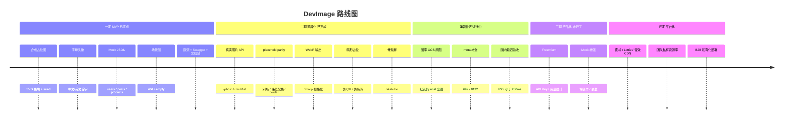

# DevImage 完整开发文档

> 国内开发者占位资源 CDN · 功能规格 · 参数属性 · 分期规划  
> 基准域名：`https://cdn.devimg.cn` · 文档站：`https://devimg.cn`  
> 最后更新：2026-08 · **实现状态以 `apps/api` 与 [apps/docs/guide/dev-spec.md](../apps/docs/guide/dev-spec.md) 为准**

---

## 1. 文档说明

| 文档 | 用途 |
| ------ | ------ |
| **本文档** | 功能全集、参数属性、分期规划、实现状态 |
| [MVP功能优先级PRD](./MVP功能优先级PRD.md) | 2 周执行排期 |
| [竞品URL与API对照表](./竞品URL与API对照表.md) | 与 picsum/placehold 迁移对照 |
| [腾讯云COS部署指南](./腾讯云COS部署指南.md) | 生产部署 |
| [Freemium定价与成本模型](./Freemium定价与成本模型.md) | 商业化 |
| [apps/docs/](../apps/docs/) | 面向用户的 API 文档站 |

### 状态图例

| 标记 | 含义 |
| ------ | ------ |
| ✅ | 已实现 |
| 🚧 | 部分实现 |
| 📋 | 已规划，未开发 |
| 🔮 | 远期（平台化） |

---

## 2. 产品定位

**一句话**：国内开发者的零配置占位 CDN — 复制 URL 即可用于 ``、`fetch()`，替代 picsum 国内慢的问题。

**长期愿景**：Developer Assets Platform（占位图 → Mock → 图标/Lottie/音效 → 统一 CDN）

---

## 3. 分期总览


```mermaid
timeline
  title DevImage 路线图
  section 一期 MVP 已完成
    合成占位图 : SVG 色块 + seed
    字母头像 : 中文/英文首字
    Mock JSON : users / posts / products
    场景图 : 404 / empty
    限流 + Swagger + 文档站
  section 二期 差异化 已完成
    真实照片 API : /photo /id /v2/list
    placehold parity : 别名 / 路径配色 / border
    WebP 输出 : Sharp 栅格化
    码形占位 : 伪 QR / 伪条码
    骨架屏 : /skeleton
  section 运营补齐 进行中
    图库 COS 原图 : 默认仍 local 出图
    meta 补全 : 699 / 8132
    国内延迟验收 : P95 小于 200ms
  section 三期 产品化 未开工
    Freemium : API Key / 用量统计
    Mock 增强 : 写操作 / 嵌套
  section 四期 平台化
    图标 / Lottie / 音效 CDN
    团队私有资源库
    B2B 私有化部署
```

### 分期对照表

| 阶段 | 时间目标 | 核心交付 | 状态 |
| ------ | ---------- | ---------- | ------ |
| **一期** | 2 周 | 合成图、头像、Mock、场景、文档、腾讯云部署 | ✅ 已完成 |
| **二期** | +2–4 周 | `/photo` API、picsum 兼容、WebP、骨架屏、码形、placehold parity | ✅ API 已完成；图库 COS 原图 / meta 🚧 |
| **运营** | 上线后 | COS 原图、meta 补全、CDN 预热、延迟验收 | 🚧 进行中 |
| **三期** | +1–2 月 | API Key、Freemium、Mock 写操作 / 嵌套 | 📋 未开工 |
| **四期** | 长期 | 多资源类型统一平台 | 🔮 |

---

## 4. 全局约定

### 4.1 URL 设计原则

- **图片 CDN 路径不加 `/v1`**（与 picsum 一致，URL 长期稳定）
- **管理类接口**（OpenAPI、未来控制台）可使用 `/v1`
- Path 参数用 `/` 分隔；placehold 风格 `800x600` **已实现**

### 4.2 通用参数约束

| 约束项 | 规则 |
| -------- | ------ |
| 宽度 / 高度 | 整数，`10` ~ `4000` |
| 颜色 `bg` / `fg` | hex，3 位或 6 位，**不含 `#`** |
| 文字 `text` | 最长 **50** 字符，SVG 转义 |
| 名称 `name` | URL 编码，支持中文 |
| Mock `count` | 1 ~ **100**，默认 10 |
| Mock `id` | 1 ~ **100** |

### 4.3 参数别名（已实现）

| 主参数 | 兼容别名 | 状态 |
| -------- | ---------- | ------ |
| `bg` | `bc` | ✅ |
| `fg` | `tc` | ✅ |
| `text` | `t` | ✅ |
| `w` / `h`（query） | `width` / `height` | 📋 占位路由仍用 path 尺寸；query 别名未接管 |
| `bgColor` / `textColor` | — | 📋 未实现 |

### 4.4 响应头规范

| 资源类型 | Content-Type | Cache-Control |
| ---------- | -------------- | --------------- |
| 随机合成图 | `image/svg+xml; charset=utf-8` | `public, max-age=3600` |
| seed / 头像 | `image/svg+xml; charset=utf-8` | `public, max-age=31536000, immutable` |
| 场景图 | `image/svg+xml; charset=utf-8` | `public, max-age=86400` |
| 真实照片 | `image/webp` | `public, max-age=31536000, immutable` |
| Mock JSON | `application/json; charset=utf-8` | `public, max-age=300` |

### 4.5 错误响应

| HTTP | 场景 | 响应体 |
| ------ | ------ | -------- |
| `400` | 尺寸/颜色/variant 非法 | JSON `{ statusCode, message }` |
| `404` | Mock id 不存在 | JSON `{ statusCode, message }` |
| `429` | 超过限流 | JSON（Throttler 默认） |

### 4.6 限流（已上线）

| 项 | 值 |
| ---- | ----- |
| 策略 | 全局限流 `@nestjs/throttler` |
| 默认（SVG / JSON） | **1000 次 / 分钟 / IP** |
| 栅格 WebP / PNG | **60 次 / 分钟 / IP** |
| 栅格尺寸 | 单边上限 **1024**；更大请用 SVG |

### 4.7 CORS

```http
Access-Control-Allow-Origin: *
```

---

## 5. 功能模块详解

---

### 5.1 合成占位图（Placeholder）

**用途**：替代 placehold.co / 纯色块占位，国内毫秒级 SVG。

#### 5.1.1 `GET /:width/:height`

| 属性 | 说明 |
| ------ | ------ |
| **分期** | 一期 ✅ |
| **状态** | ✅ 已实现 |
| **方法** | GET |
| **响应** | SVG 图片 |

##### 5.1.1 Path 参数

| 参数 | 类型 | 必填 | 约束 | 说明 |
| ------ | ------ | ------ | ------ | ------ |
| `width` | number | 是 | 10–4000 | 图片宽度（path 段 `:w`） |
| `height` | number | 是 | 10–4000 | 图片高度（path 段 `:h`） |

##### 5.1.1 Query 参数

| 参数 | 类型 | 必填 | 默认 | 说明 |
| ------ | ------ | ------ | ------ | ------ |
| `text` | string | 否 | `{width}×{height}` | 显示文字 |
| `bg` | string | 否 | 随机灰 `#cccccc` | 背景色 hex |
| `fg` | string | 否 | `#666666` | 文字色 hex |

##### 5.1.1 行为

- 无 seed：每次请求背景色**随机**（HSL 随机 hue）
- 有 `bg`/`fg` 时忽略随机色

##### 5.1.1 示例

```html


```

---

#### 5.1.2 `GET /seed/:seed/:width/:height`

| 属性 | 说明 |
| ------ | ------ |
| **分期** | 一期 ✅ |
| **状态** | ✅ 已实现 |
| **方法** | GET |
| **响应** | SVG 图片（确定性） |

##### 5.1.2 Path 参数

| 参数 | 类型 | 必填 | 说明 |
| ------ | ------ | ------ | ------ |
| `seed` | string | 是 | 任意字符串，决定配色与表现 |
| `width` | number | 是 | 10–4000 |
| `height` | number | 是 | 10–4000 |

##### 5.1.2 Query 参数

| 参数 | 类型 | 必填 | 默认 | 说明 |
| ------ | ------ | ------ | ------ | ------ |
| `text` | string | 否 | `{width}×{height}` | 显示文字 |
| `bg` | string | 否 | 由 seed 推导 | 背景色 |
| `fg` | string | 否 | 由 seed 推导 | 文字色 |

##### 5.1.2 行为

- 相同 `seed` + 相同尺寸 → **永远相同**配色（基于 seed hash → HSL）

##### 5.1.2 示例

```html

```

---

#### 5.1.3 格式与扩展

| 功能 | 路由/参数 | 分期 | 状态 |
| ------ | ----------- | ------ | ------ |
| SVG 后缀 | `/800/600.svg` | 二期 | ✅ |
| WebP 输出 | `/800/600.webp` 或 `?format=webp` | 二期 | ✅ |
| PNG 输出 | `.png` | 二期 | ✅ |
| 边框 | `?border=1&borderColor=000` | 二期 | ✅ |
| 叉号标记 | `?cross=1` | 二期 | ✅ |
| placehold 别名 | `/800x600` | 二期 | ✅ |
| 路径配色 | `/800/600/eee/fff` | 二期 | ✅ |
| 纹理占位 | `?style=pattern&pattern=` | 二期 | ✅ |
| query 尺寸 | `?width=800&height=600` | — | 📋 未接管 |
| 灰度 / 模糊 | `?grayscale=1&blur=2` | 二期（photo） | ✅ 仅 `/photo` `/id` |

---

### 5.2 头像占位（Avatar）

**用途**：替代 DiceBear / UI Avatars / Jdenticon，支持中文首字与多风格 seed 头像。

**阶段状态**：✅ **告一段落**（2026-07）— 59 种风格、Playground 画廊、`GET /avatar/styles` 已上线；**暂不再新增风格**。码形占位（`/qr` / `/barcode`）已独立上线，见 [码形占位规划](./伪二维码占位规划.md)。

#### 5.2.1 `GET /avatar/:style/:seed/:size`

| 属性 | 说明 |
| ------ | ------ |
| **分期** | 一期 ✅（超出原 MVP 范围提前完成） |
| **状态** | ✅ 已实现 |
| **方法** | GET |
| **响应** | SVG（默认）；`.webp` / `.png` 栅格 |

##### 5.2.1 Path 参数

| 参数 | 类型 | 必填 | 约束 | 说明 |
| ------ | ------ | ------ | ------ | ------ |
| `style` | string | 是 | 见 `/avatar/styles` | 图即 `devimg*` 或三方 `lorelei` 等 |
| `seed` | string | 是 | URL 编码 | 用户名、昵称或任意 seed |
| `size` | number | 是 | 10–4000 | 正方形边长（px） |

##### 5.2.1 Query 参数（因 style 而异）

| 参数 | 类型 | 说明 |
| ------ | ------ | ------ |
| `variant` | string | 主风格 `devimg`：背景变体 |
| `text` | string | 覆盖显示字符（≤ 50） |
| `bg` / `fg` | string | hex 背景 / 前景 |
| `pattern` | string | 纹理 id（`devimg-pattern`） |

##### 5.2.1 辅助路由

| 路由 | 说明 |
| ------ | ------ |
| `GET /avatar/styles` | 风格 JSON 列表 |
| `GET /avatar/patterns` | 纹理 pattern 目录 |

##### 5.2.1 示例

```html


```

用户文档：[apps/docs/api/avatar.md](../apps/docs/api/avatar.md)

---

#### 5.2.2 遗留别名（兼容）

| 路由 | 说明 | 状态 |
| ------ | ------ | ------ |
| `GET /avatar/:name/:size` | 等价 `devimg/:name/:size` | ✅ |

---

#### 5.2.3 远期（非当前优先级）

| 功能 | 路由 | 分期 | 状态 |
| ------ | ------ | ------ | ------ |
| 设计师 Sprite 拼接 | 多 style 美术包 | 四期 | 📋 |
| 圆角矩形 | `?shape=rounded` | 远期 | 📋 |

---

### 5.3 场景占位图（Scene）

**用途**：404、空状态、网络错误等 UI 场景插画占位。

#### 5.3.1 `GET /scene/:variant`

| 属性 | 说明 |
| ------ | ------ |
| **分期** | 一期 ✅ |
| **状态** | ✅ 已实现 |
| **方法** | GET |
| **响应** | SVG 场景图 |

##### 5.3.1 Path 参数 — `variant`

| 值 | 标题 | 副标题 | 分期 |
| ---- | ------ | -------- | ------ |
| `404` | 404 | 页面不存在 | 一期 ✅ |
| `empty` | 暂无数据 | 这里还是空的 | 一期 ✅ |
| `network` | 网络异常 | 请检查网络后重试 | 一期 ✅ |
| `search` | 无搜索结果 | 换个关键词试试 | 一期 ✅ |
| `error` | 出错了 | 请稍后重试 | 三期 📋 |
| `loading` | 加载中 | … | 三期 📋 |

##### 5.3.1 Query 参数

| 参数 | 类型 | 必填 | 默认 | 说明 |
| ------ | ------ | ------ | ------ | ------ |
| `w` | number | 否 | 800 | 宽度 10–4000 |
| `h` | number | 否 | 600 | 高度 10–4000 |
| `theme` | string | 否 | `light` | `light` \| `dark` |
| `title` | string | 否 | variant 默认 | 覆盖标题 |
| `subtitle` | string | 否 | variant 默认 | 覆盖副标题 |
| `accent` | string | 否 | 主题默认 | 强调色 hex，不含 `#` |
| `seed` | string | 否 | — | 固定调色板 |

##### 5.3.1 示例

```html


```

---

#### 5.3.2 `GET /404`（快捷路由）

| 属性 | 说明 |
| ------ | ------ |
| **分期** | 一期 ✅ |
| **状态** | ✅ 已实现 |
| **等价于** | `GET /scene/404` |

**Query**：同 `w`、`h`

---

#### 5.3.3 骨架屏

| 属性 | 说明 |
| ------ | ------ |
| **分期** | 二期 ✅ |
| **状态** | ✅ 已实现 |
| **路由** | `GET /skeleton/:w/:h` |

| Query | 说明 |
| ------ | ------ |
| `type` | `page`（默认）\| `card` \| `row` \| `grid` |
| `theme` | `light`（默认）\| `dark` |
| `cols` | grid 列数 1–6，默认 3 |
| `animate` | `0`（默认）\| `1` shimmer |

插画级 `error` / `loading` 场景仍为三期。empty 不再用 query 子类型，独立 variant 为 `/scene/empty`、`/scene/search`、`/scene/network`。

---

### 5.4 码形占位（伪 QR · 伪条码）

**用途**：支付 mock、列表骨架、物流 UI 等需要「码形视觉」但**不可扫描**的占位图。详见 [码形占位规划](./伪二维码占位规划.md)。

| 属性 | 说明 |
| ------ | ------ |
| **分期** | Phase 2.5 |
| **状态** | ✅ P1–P3 已实现（`/qr` / `/barcode` / `/code/styles`） |

#### 5.4.1 `GET /qr/:seed/:size` · `GET /qr/:seed/:w/:h`

| 参数 | 说明 |
| ------ | ------ |
| `seed` | 短标识，确定性图案（非业务 payload） |
| `size` / `w`×`h` | 10–4000；矩形路由居中留边 |
| Query | `fg` / `bg` / `accent` / `variant=matrix\|minimal\|dots` / `radius=0-50` |

#### 5.4.2 `GET /barcode/:seed/:w/:h`

| 参数 | 说明 |
| ------ | ------ |
| `seed` | 短标识 |
| `w` / `h` | 10–4000，常见 320×80 |
| Query | `fg` / `bg` / `variant=code128\|ean13` |

#### 5.4.3 `GET /code/styles`

码形占位 variant 与 query 参数 JSON 目录。

#### 5.4.4 明确不做（短期）

- URL 传入 `data=` 生成**可扫描**真实 QR / 条形码（分析见规划文档 §8）
- 与占位 CDN 定位冲突；若远期做需独立 `/encode/*` 与 API Key

---

### 5.5 Mock 数据（Mock API）

**用途**：替代 JSONPlaceholder，国内低延迟假 REST 数据。

#### 5.5.1 `GET /mock/users`

| 属性 | 说明 |
| ------ | ------ |
| **分期** | 一期 ✅ |
| **状态** | ✅ 已实现 |

##### 5.5.1 Query 参数

| 参数 | 类型 | 必填 | 默认 | 说明 |
| ------ | ------ | ------ | ------ | ------ |
| `count` | number | 否 | 10 | 返回条数，最大 100 |

**响应**：`User[]`

| 字段 | 类型 | 说明 |
| ------ | ------ | ------ |
| `id` | number | 1 起递增 |
| `name` | string | 中文姓名（faker zh_CN） |
| `email` | string | 邮箱 |
| `avatar` | string | 指向 DevImage 头像 URL |
| `phone` | string | 手机号 |
| `address` | string | 城市 |

---

#### 5.5.2 `GET /mock/users/:id`

| 属性 | 说明 |
| ------ | ------ |
| **分期** | 一期 ✅ |
| **状态** | ✅ 已实现 |

**Path**：`id` 范围 **1–100**，超出返回 `404`

**响应**：单个 `User` 对象（`id` 固定 seed，同 id 内容稳定）

---

#### 5.5.3 `GET /mock/posts`

| 属性 | 说明 |
| ------ | ------ |
| **分期** | 二期（PRD 排期） / 代码已提前实现 |
| **状态** | ✅ 已实现 |

**Query**：`count`（默认 10，最大 100）

**响应**：`Post[]`

| 字段 | 类型 | 说明 |
| ------ | ------ | ------ |
| `id` | number | 文章 ID |
| `userId` | number | 作者 ID |
| `title` | string | 标题 |
| `body` | string | 正文 |

---

#### 5.5.4 `GET /mock/products`

| 属性 | 说明 |
| ------ | ------ |
| **分期** | 二期（PRD 排期） / 代码已提前实现 |
| **状态** | ✅ 已实现 |

**Query**：`count`

**响应**：`Product[]`

| 字段 | 类型 | 说明 |
| ------ | ------ | ------ |
| `id` | number | 商品 ID |
| `name` | string | 商品名 |
| `price` | number | 价格 |
| `image` | string | 占位图 URL |

---

#### 5.5.5 Mock 扩展

| 功能 | 路由 | 分期 | 状态 |
| ------ | ------ | ------ | ------ |
| 单条 posts | `GET /mock/posts/:id` | 二期 | ✅ |
| 单条 products | `GET /mock/products/:id` | 二期 | ✅ |
| 分页 | `?_page=1&_limit=10` | 二期 | ✅ |
| 封面 / 商品图 | `cover` / `image` 指向 `/photo`，无图回退色块 | 二期 | ✅ |
| 嵌套 comments | `GET /mock/posts/:id/comments` | 三期 | 📋 |
| POST/PUT/DELETE | 返回 fake 成功，不落库 | 三期 | 📋 |
| 自定义 Mock | 用户上传 JSON Schema | 四期 | 🔮 |
| albums / photos / todos | JSONPlaceholder 全资源 | 三期 | 📋 |

---

### 5.6 真实照片（Photo）

**用途**：替代 picsum.photos 随机真实照片。运行时 manifest：`apps/api/data/photo/`（**82 cat · 8132 张 · 15 scene**）。禁止同步请求 Pexels。

| 属性 | 说明 |
| ------ | ------ |
| **分期** | 二期 |
| **状态** | ✅ API 已上线；🚧 默认 `PHOTO_SERVE_MODE=local`，COS 原图与 meta 补全进行中 |
| **meta** | `photos.json` 中 `enriched_meta` **699 / 8132** |

#### 5.6.1 `GET /photo/:width/:height`

| 属性 | 说明 |
| ------ | ------ |
| **方法** | GET |
| **响应** | WebP（默认）/ JPEG / PNG |

##### 5.6.1 Query 参数

| 参数 | 类型 | 必填 | 说明 |
| ------ | ------ | ------ | ------ |
| `scene` | string | 否 | 用途 slug，如 `product`、`food`、`banner` |
| `cat` | string | 否 | 中文题材，如 `美食`；与 `scene` 指定其一即可 |
| `seed` | string | 否 | 有则固定选图；省略则随机 |
| `grayscale` | `0\|1` | 否 | 灰度 |
| `blur` | 1–10 | 否 | 模糊强度 |
| `format` | string | 否 | `webp`（默认）\| `jpeg` \| `png` |

##### 5.6.1 行为

1. 按 `scene` / `cat` / `seed` 从本地 manifest 选图
2. Sharp 裁剪到目标尺寸；命中 COS 变体缓存则复用
3. 未配置 COS 时从本地 / 已配置的 `cos_key` 读原图并直出
4. 响应头 `X-DevImage-Photo-Id` 为选中图库 id

##### 5.6.1 辅助路由

| 路由 | 说明 |
| ------ | ------ |
| `GET /photo/categories` | 题材列表 JSON |
| `GET /photo/scenes` | 用途列表 JSON |

---

#### 5.6.2 picsum 兼容路由

| 路由 | 说明 | 状态 |
| ------ | ------ | ------ |
| `GET /photo/:w/:h` | 按 scene/cat 取图 | ✅ |
| `GET /id/:id/:w/:h` | 固定图库 ID | ✅ |
| `GET /id/:id/info` | 照片元信息 | ✅ |
| `GET /v2/list` | 列表；`page` / `limit` / `cat` | ✅ |
| `ENABLE_PICSUM_COMPAT` | 把 `/:w/:h` 映射成 photo | 📋 未做；`/:w/:h` 仍为合成 SVG |

##### 5.6.2 COS 路径（规划 / 生产）

```text
devimage-125xxxxxx/
├── photos/{id}/{w}x{h}.webp    # 变体缓存
└── assets/seed-pack/           # CC0 原图（待批量上传）
```

##### 5.6.2 运营缺口

| 项 | 现状 |
| ------ | ------ |
| 原图上 COS | 🚧 默认仍本地出图 |
| meta 补全 | 🚧 699 / 8132 |
| CDN 预热 | 📋 原图齐后再做 |

---

### 5.7 系统接口（Health / Docs）

#### 5.7.1 `GET /health`

| 属性 | 说明 |
| ------ | ------ |
| **分期** | 一期 ✅ |
| **状态** | ✅ 已实现 |

##### 5.7.1 响应 JSON

| 字段 | 类型 | 示例 |
| ------ | ------ | ------ |
| `status` | string | `ok` |
| `service` | string | `devimage-api` |
| `version` | string | `0.1.0` |
| `timestamp` | string | ISO 8601 |

---

#### 5.7.2 `GET /api/docs`

| 属性 | 说明 |
| ------ | ------ |
| **分期** | 一期 ✅ |
| **状态** | ✅ Swagger UI |
| **说明** | NestJS Swagger，开发环境 `http://localhost:3000/api/docs` |

---

### 5.8 远期模块（四期 🔮）

| 模块 | 路由示例 | 说明 |
| ------ | ---------- | ------ |
| 图标 | `/icon/:name/:size` | SVG 图标 CDN |
| Lottie | `/lottie/:name` | 空状态动画 JSON |
| 音效 | `/sfx/:name` | 点击/通知等短音效 |
| 短视频 | `/video/:name` | loop 背景视频 |
| 字体切片 | `/font/:family` | CJK 子集 CDN |

---

## 6. 一期 / 二期 / 三期功能清单

### 6.1 一期（MVP · 已完成）

| # | 功能 | 路由 | 代码状态 |
| --- | ------ | ------ | ---------- |
| 1 | 随机占位图 | `GET /:w/:h` | ✅ |
| 2 | seed 占位图 | `GET /seed/:s/:w/:h` | ✅ |
| 3 | 字母/中文头像 | `GET /avatar/:style/:seed/:size`（50+ 风格） | ✅ 告一段落 |
| 4 | 404 场景 | `GET /scene/404`、`GET /404` | ✅ |
| 5 | 空状态/网络/搜索 | `GET /scene/:variant` | ✅ |
| 6 | Mock 用户 | `GET /mock/users`、`/mock/users/:id` | ✅ |
| 7 | Mock 文章/商品 | `GET /mock/posts`、`/mock/products` | ✅ |
| 8 | 健康检查 | `GET /health` | ✅ |
| 9 | Swagger | `GET /api/docs` | ✅ |
| 10 | IP 限流 | 1000/min（栅格 60/min） | ✅ |
| 11 | VitePress 文档站 | `devimg.cn` | ✅ |
| 12 | 腾讯云部署 | 轻量 + Nginx + PM2 + `pnpm deploy` | ✅ |

---

### 6.2 二期（差异化 + picsum 替代 · API 已完成）

| # | 功能 | 说明 | 状态 |
| --- | ------ | ------ | ------ |
| 1 | `/photo/:w/:h` | scene/cat/seed 真实照片 | ✅ |
| 2 | `/id/:id/:w/:h` | 固定照片 ID | ✅ |
| 3 | `/id/:id/info` | 照片元数据 | ✅ |
| 4 | `/v2/list` | 照片列表 API | ✅ |
| 5 | WebP / PNG 输出 | Sharp；单边上限 1024 | ✅ |
| 6 | `/skeleton/:w/:h` | 4 type + theme + animate | ✅ |
| 7 | 参数别名 | `bc` / `tc` / `t` | ✅；`width`/`height` query 未接管 |
| 8 | `?border` / `?cross` | placehold 风格扩展 | ✅ |
| 9 | `/800x600` 别名 | placehold 兼容 | ✅ |
| 10 | 码形占位 | `/qr` / `/barcode` / `/code/styles` | ✅ |
| 11 | Mock 单条 + 分页 | `_page` `_limit` | ✅ |
| 12 | scene 文案 query | theme / title / subtitle / accent / seed | ✅ |
| 13 | 图库 COS 原图 | 生产切 `PHOTO_SERVE_MODE` + 批量上传 | 🚧 |
| 14 | 图库 meta | 699 / 8132 enriched | 🚧 |
| 15 | `X-DevImage-Requests` | 用量响应头 | 📋 三期 |
| 16 | picsum 兼容开关 | `/:w/:h` 映射到 photo | 📋 不做（避免与色块冲突） |

---

### 6.3 三期（产品化）

| # | 功能 | 说明 |
| --- | ------ | ------ |
| 1 | API Key 鉴权 | Free / Pro 分层 |
| 2 | 用量面板 | 请求数、带宽 |
| 3 | Freemium 限流 | 按 tier 不同 QPS |
| 4 | Mock 写操作 | POST/PUT/DELETE fake |
| 5 | Mock 嵌套资源 | comments、albums |
| 6 | 头像多风格 | ✅ 已提前完成（59 风格），暂冻结新风格 |
| 7 | 场景 `error` / `loading` variant | 仍为文案 SVG 即可 |
| 8 | 统一错误页 | SVG + JSON |
| 9 | 结构化日志 | pino + requestId |

---

### 6.4 四期（Developer Assets Platform）

| # | 功能 | 说明 |
| --- | ------ | ------ |
| 1 | 图标 CDN | 常用 icon set |
| 2 | Lottie CDN | loading / empty 动画 |
| 3 | 音效 CDN | UI sfx |
| 4 | 团队私有库 | 自定义 seed 包 |
| 5 | B2B 私有化 | Docker 交付 |
| 6 | CLI / SDK | `@devimage/cli` |

---

## 7. 模块与代码映射

```text
apps/api/src/
├── placeholder/     ✅  /:w/:h, /seed/, 800x600, 路径配色
├── avatar/          ✅  /avatar/（50+ 风格，暂不再扩展）
├── code/            ✅  /qr/ · /barcode/ · /code/styles
├── scene/           ✅  /scene/, /404（文案 SVG）
├── skeleton/        ✅  /skeleton/
├── mock/            ✅  /mock/*（读 + 分页）
├── photo/           ✅  /photo/, /id/, /v2/list
├── common/          ✅  校验、栅格、限流
└── health/          ✅  /health
```

---

## 8. 基础设施分期

| 组件 | 现状 | 下一步 |
| ------ | ------ | ------ |
| 腾讯云轻量 | ✅ API 监听 3010 + PM2 | 按量升配 |
| COS | 🚧 变体缓存代码已通；原图未批量上传 | 上传 seed-pack |
| CDN | ✅ `cdn.devimg.cn` | 原图预热 |
| 文档站 | ✅ `devimg.cn` | — |
| Nginx / Certbot | ✅ | — |
| ICP 备案 | ✅ 域名已用 | — |

详见 [腾讯云COS部署指南](./腾讯云COS部署指南.md)。

---

## 9. 开发验收标准

### 一期 / 二期发布 Checklist

- [x] 一期 + 二期 API 路由可用
- [x] 文档站与对外口径（`devimg.cn`）上线
- [x] 腾讯云轻量 + Nginx + PM2 + `pnpm deploy`
- [x] 掘金宣发已发布（**不入库**）
- [ ] 图库原图批量上 COS，生产切 COS 出图
- [ ] 图库 meta 补全（当前 699 / 8132）
- [ ] 国内 P95 延迟 < 200ms（CDN 后）
- [ ] `pnpm test` 作为发版门禁保持绿灯

### 单接口验收模板

```text
1. 合法参数 → 200 + 正确 Content-Type
2. 边界尺寸 10 / 4000 → 200
3. 非法尺寸 9 / 4001 → 400
4. 非法颜色 → 400
5. Cache-Control 符合规范
6. 文档示例 URL 可浏览器直接打开
```

---

## 10. 相关链接

| 资源 | 地址 |
| ------ | ------ |
| 本地 API | <http://localhost:3000> |
| 本地 Swagger | <http://localhost:3000/api/docs> |
| 本地文档 | <http://localhost:5173> |
| 规划 COS 变量 | `apps/api/.env.example` |

---

## 附录 A：与 picsum / placehold 迁移速查

| 原服务 | 原 URL | DevImage（一期） | DevImage（二期） |
| -------- | -------- | ------------------ | ------------------ |
| placehold.co | `/600x400` | `/600/400` | `/600x400` 别名 |
| placehold.co | `?text=Hi` | `/600/400?text=Hi` | 同左 |
| picsum | `/800/600` | `/800/600`（合成 SVG） | `/photo/800/600` |
| picsum | `/seed/x/800/600` | `/seed/x/800/600` | 同左 |
| picsum | `/id/237/800/600` | — | `/id/237/800/600` ✅ |
| JSONPlaceholder | `/posts/1` | `/mock/posts`（列表） | `/mock/posts/1` ✅ |
| DiceBear | `?seed=x&size=48` | `/avatar/x/48` | `/avatar/style/x/48` |

---

## 附录 B：版本记录

| 版本 | 日期 | 说明 |
| ------ | ------ | ------ |
| v0.1.0 | 2026-07 | 一期 MVP：placeholder / avatar / scene / mock / health |
| v0.2.0 | 2026-07 | 二期：骨架屏、placehold parity、photo API、码形、栅格 |
| v0.2.1 | 2026-08 | 生产域名 `cdn.devimg.cn` / `devimg.cn`、一键部署、文档口径 |
