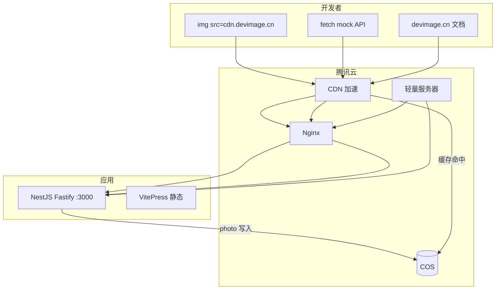

# 技术栈选型评估：Node.js + TypeScript + NestJS

---

## 1. 结论

**推荐采用：Node.js + TypeScript + NestJS（Fastify 适配器）+ VitePress 文档站。**

| 维度 | 评分 | 说明 |
| ------ | ------ | ------ |
| 与产品匹配度 | ⭐⭐⭐⭐⭐ | 路由多、模块清晰、后续 Mock/Admin 易扩展 |
| 国内部署 | ⭐⭐⭐⭐⭐ | 腾讯云轻量 + COS + CDN |
| 性能 | ⭐⭐⭐⭐ | SVG 足够；Sharp 可选；Fastify 弥补 Express 不足 |
| 开发效率 | ⭐⭐⭐⭐ | 约定优于配置，Swagger 开箱 |
| 学习成本 | ⭐⭐⭐ | 比 Express 重，比 Go 轻 |
| 文档站一体 | ⭐⭐⭐⭐⭐ | VitePress 与 TS 生态一致 |

**不推荐首期用 Cloudflare Workers**（国内目标用户、Sharp 受限、与 NestJS 体系割裂）。

---

## 2. 为什么选 NestJS

### 2.1 项目特征匹配

DevImage 表面是「图片 CDN」，本质是 **多路由类型的 API 网关**：

- `/placeholder` — SVG 生成
- `/avatar` — 模板引擎
- `/mock` — JSON 工厂
- `/photo` — 缓存 + 存储（Phase 2）
- 未来：限流、API Key、用量统计、管理后台

NestJS 的 **Module / Controller / Service** 分层适合这种会持续长大的 API 平台，而不是单一脚本。

### 2.2 与竞品技术对齐

| 参考 | 技术 |
| ------ | ------ |
| DiceBear API | Fastify + Docker 自托管 |
| JSONPlaceholder | Express（轻量） |
| placeholders.dev | Cloudflare Workers |

NestJS + Fastify 兼顾 Express 生态与性能，且便于以后抽 `packages/generators` 共享逻辑。

### 2.3 何时 NestJS 过重？

若产品**永远**只有 3 个 SVG 路由、无 Mock、无管理端 → **Hono / Fastify 单文件**更合适。  
你的路线图是 **Developer Assets Platform** → NestJS 合理。

---

## 3. 推荐完整技术栈

### 3.1 Monorepo

```base
pnpm workspace
├── apps/api      # NestJS + Fastify
├── apps/docs     # VitePress
└── packages/shared   # 类型、常量（可选）
```

### 3.2 API 层

| 技术 | 用途 |
| ------ | ------ |
| NestJS 11 | 框架 |
| `@nestjs/platform-fastify` | HTTP 适配器（性能） |
| class-validator | 参数校验 |
| @nestjs/swagger | OpenAPI |
| pino / nestjs-pino | 日志 |
| @nestjs/throttler | 限流 |
| sharp（Phase 1.5） | webp/png  raster |
| @faker-js/faker | Mock 数据 |

### 3.3 文档站

| 技术 | 用途 |
| ------ | ------ |
| VitePress 1.x | 静态文档、Markdown、搜索 |
| Vue 3 | 自定义组件（API  playground） |
| 部署 | 构建产物上传 COS 或轻量 Nginx 静态托管 |

**为什么不用 NestJS 渲染文档？** 文档站是静态内容，VitePress  SEO、导航、搜索更好，构建产物可 CDN 缓存。

### 3.4 部署（腾讯云）

| 层 | 方案 |
| ---- | ------ |
| 计算 | 腾讯云轻量应用服务器 / CVM |
| 进程 | PM2 cluster |
| 反向代理 | Nginx（SSL、gzip、SVG 短缓存） |
| 对象存储 | **COS**（photo 缓存、精选图包） |
| 加速 | **腾讯云 CDN**（备案后绑定自定义域名） |
| CI | GitHub Actions → SSH 部署轻量 / COS 同步 |

详见 [腾讯云COS部署指南.md](./腾讯云COS部署指南.md)。

---

## 4. 架构图



---

## 5. NestJS 注意事项

### 5.1 图片二进制响应

使用 Fastify 的 `@Res()` 或 `@Header()` + `Buffer`/`string` 直出，避免 JSON 序列化：

```typescript
// Controller 返回 image/svg+xml，不走全局 JSON 拦截器
@Header('Content-Type', 'image/svg+xml')
@Header('Cache-Control', 'public, max-age=31536000, immutable')
getPlaceholder(): string {
  return this.placeholderService.renderSvg(options);
}
```

### 5.2 路由顺序

`/:w/:h` 与 `/health`、`/mock/*` 冲突 — **静态路由先注册，通配路由放最后**。

### 5.3 不要用 NestJS 做重度图片流水线

批量 Pexels 拉取、定时预热 → 独立 `scripts/` 或 `@nestjs/schedule` 后台任务，与请求路径解耦。

---

## 6. 备选方案对比

| 方案 | 优点 | 缺点 | verdict |
| ------ | ------ | ------ | ---------- |
| Express + TS | 最轻 | 大项目结构混乱 | 小 MVP 可，不适合平台 |
| Hono | 极快、边缘友好 | 与腾讯云 COS SDK 集成无优势 | 备选 |
| Go + Gin | 性能最强 | 前后端两套语言 | 非必要 |
| NestJS + Express | 默认简单 | 性能略逊 | 改用 Fastify |
| **NestJS + Fastify** | 结构 + 性能 | 略重 | **选用** |

---

## 7. 文档站与 API 联调

| 环境变量 | 说明 |
| ---------- | ------ |
| `VITE_API_BASE` | 文档站示例 URL 前缀 |
| 开发 | API `localhost:3000`，Docs `localhost:5173` |
| 生产 | `cdn.devimage.cn` / `devimage.cn` |

文档站内嵌 live preview 组件（Phase 2）：

```vue
<!-- ApiPreview.vue：输入路径，iframe/img 实时预览 -->
```

---

## 8. 最终推荐命令

```base
# 安装依赖
pnpm install

# 同时开发 API + 文档
pnpm dev

# 构建
pnpm build

# 生产启动
pnpm start:prod
```

---

## 9. 决策记录

| 日期 | 决策 | 原因 |
| ------ | ------ | ------ |
| 2026-07 | Node + TS + NestJS + Fastify | 腾讯云部署、平台化扩展、Swagger |
| 2026-07 | VitePress 独立 docs app | 静态文档体验、SEO |
| 2026-07 | 腾讯云轻量 + COS + CDN | 国内用户优先、photo 缓存 |
| 2026-07 | 不用 Workers 首期 | 国内用户优先 |
