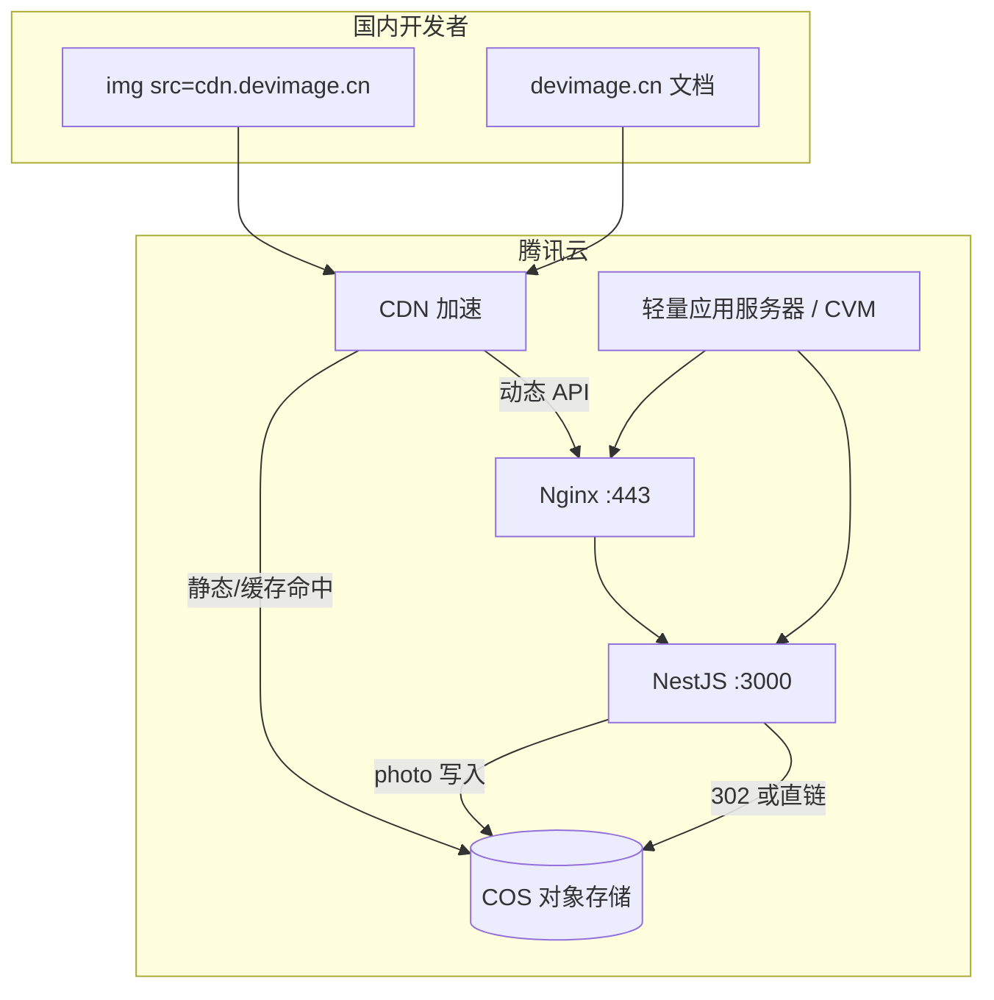

# 腾讯云 + COS 部署指南

> DevImage 生产环境标准架构：**腾讯云轻量/CVM + COS + CDN + Nginx + PM2**

---

## 1. 架构总览



### 职责划分

| 组件 | 职责 |
|------|------|
| **轻量/CVM** | 跑 NestJS API、Nginx 反代、PM2 进程管理 |
| **COS** | `/photo` 缓存图、精选图包、文档站静态产物（可选） |
| **CDN** | 国内加速；SVG/JSON 回源 API，图片命中 COS |
| **Nginx** | SSL 终结、API 反代、本地 proxy_cache（SVG 热路径） |

---

## 2. 腾讯云资源清单

### 2.1 推荐配置（MVP）

| 资源 | 规格 | 预估月费 |
|------|------|----------|
| 轻量应用服务器 | 2核4G，带宽 5M，**广州/上海** | ¥45–65 |
| COS 标准存储 | 按量，50GB 内 | ¥1–5 |
| CDN 流量 | 按量，100GB 内 | ¥15–25 |
| 域名 + ICP 备案 | .cn × 2 | 域名 ¥6/年摊销 |

### 2.2 需开通的产品

1. [轻量应用服务器 Lighthouse](https://cloud.tencent.com/product/lighthouse) 或 [云服务器 CVM](https://cloud.tencent.com/product/cvm)
2. [对象存储 COS](https://cloud.tencent.com/product/cos)
3. [内容分发网络 CDN](https://cloud.tencent.com/product/cdn)（备案后绑定自定义域名）
4. [SSL 证书](https://cloud.tencent.com/product/ssl)（免费 DV 证书即可）

---

## 3. COS 存储规划

### 3.1 Bucket 结构

```
devimage-125xxxxxx/          # Bucket 名（含 APPID）
├── photos/                  # /photo 模块缓存（Phase 2）
│   └── {id}/{w}x{h}.webp
├── assets/                    # 精选 CC0 图包原图
│   └── seed-pack/
└── docs/                      # 可选：VitePress 构建产物
    └── .vitepress/dist/
```

### 3.2 推荐配置

| 项 | 值 |
|----|-----|
| 地域 | 与轻量服务器同地域（如 `ap-guangzhou`） |
| 访问权限 | **私有读写**（通过 CDN 或 API 签名访问） |
| 跨域 CORS | 允许 `GET`，Origin `*` |
| 生命周期 | `photos/` 180 天未访问转低频（可选） |

### 3.3 环境变量（API）

见 `apps/api/.env.example`：

```base
# 腾讯云 API 密钥（CAM 子账号，仅 COS 权限）
TENCENT_SECRET_ID=AKIDxxxxxxxx
TENCENT_SECRET_KEY=xxxxxxxx

# COS
COS_REGION=ap-guangzhou
COS_BUCKET=devimage-1250000000
COS_PHOTO_PREFIX=photos/

# 可选：COS 绑定的 CDN 自定义域名（photo 302 用）
COS_CDN_DOMAIN=https://cdn.devimage.cn
```

---

## 4. 服务器部署步骤

### 4.1 初始化轻量服务器

```bash
# Ubuntu 22.04 示例
sudo apt update && sudo apt install -y nginx git

# Node.js 20
curl -fsSL https://deb.nodesource.com/setup_20.x | sudo -E bash -
sudo apt install -y nodejs

npm install -g pnpm pm2
```

### 4.2 拉取与构建

```bash
git clone <repo> /var/www/devimage
cd /var/www/devimage
pnpm install
pnpm build
```

### 4.3 环境配置

```bash
cp apps/api/.env.example apps/api/.env
# 编辑 .env 填入 COS 密钥
```

### 4.4 PM2 启动

```bash
cd /var/www/devimage
pm2 start apps/api/dist/main.js --name devimage-api
pm2 save
pm2 startup
```

---

## 5. Nginx 配置

```nginx
# cdn.devimage.cn — API + 动态 SVG
upstream devimage_api {
    server 127.0.0.1:3000;
    keepalive 32;
}

proxy_cache_path /var/cache/nginx/devimage levels=1:2 keys_zone=devimage:10m max_size=500m inactive=7d;

server {
    listen 443 ssl http2;
    server_name cdn.devimage.cn;

    ssl_certificate     /etc/nginx/ssl/cdn.devimage.cn.pem;
    ssl_certificate_key /etc/nginx/ssl/cdn.devimage.cn.key;

    location / {
        proxy_pass http://devimage_api;
        proxy_http_version 1.1;
        proxy_set_header Host $host;
        proxy_set_header X-Real-IP $remote_addr;
        proxy_set_header X-Forwarded-For $proxy_add_x_forwarded_for;

        proxy_cache devimage;
        proxy_cache_valid 200 1h;
        proxy_cache_key $request_uri;
        add_header X-Cache-Status $upstream_cache_status;
    }
}

# devimage.cn — 文档站（可放 COS+CDN 或本机静态）
server {
    listen 443 ssl http2;
    server_name devimage.cn;

    ssl_certificate     /etc/nginx/ssl/devimage.cn.pem;
    ssl_certificate_key /etc/nginx/ssl/devimage.cn.key;

    root /var/www/devimage/apps/docs/.vitepress/dist;
    index index.html;
    try_files $uri $uri/ /index.html;
}
```

---

## 6. CDN 加速配置

### 6.1 备案要求

- 使用 **中国大陆 CDN 节点**，域名需 **ICP 备案**
- 轻量服务器 + COS + CDN 同账号管理较方便

### 6.2 加速域名建议

| 域名 | 源站 | 缓存策略 |
|------|------|----------|
| `cdn.devimage.cn` | 轻量公网 IP（Nginx 443） | SVG/JSON 短缓存；`/seed/*` `/avatar/*` 长缓存 |
| 可选 COS 源 | COS 默认域名或源站桶 | `/photos/*` 强制缓存 30d |

### 6.3 COS 回源 CDN（photo 模块 Phase 2）

1. COS 控制台 → 桶 → 域名管理 → 开启 CDN 加速
2. 绑定 `cdn.devimage.cn` 或 `img.devimage.cn`
3. API 未命中时写入 COS，响应 **302** 到 CDN URL

---

## 7. 数据流（按资源类型）

| 资源 | 路径 | 处理方式 |
|------|------|----------|
| SVG 占位 | `/:w/:h` | 轻量服务器实时生成，Nginx/CDN 短缓存 |
| seed/avatar | `/seed/*` `/avatar/*` | 同上，CDN 长缓存 immutable |
| Mock JSON | `/mock/*` | API 实时，CDN 5min |
| 真实照片 | `/photo/*` | 查 COS → 未命中异步写入 → 302 CDN |
| 文档站 | `devimage.cn` | 静态文件或 COS 托管 |

---

## 8. 监控与运维

| 项 | 方案 |
|----|------|
| 进程 | PM2 + `pm2 monit` |
| 健康检查 | `GET /health`，腾讯云可观测平台或 UptimeRobot |
| 日志 | 轻量服务器日志 + COS 访问日志 |
| 告警 | 腾讯云监控（CPU、带宽、5xx） |

---

## 9. 成本优化

1. **SVG 不占 COS**：合成图直接 API 输出，零存储费
2. **photo 只存 webp 缩略图**：不存原图，按请求尺寸存
3. **CDN 流量包**：新用户常有免费额度
4. **COS 生命周期**：冷数据转低频存储

---

## 10. 决策记录

| 日期 | 决策 |
|------|------|
| 2026-07 | 生产环境采用腾讯云轻量 + COS + CDN |
| 2026-07 | photo 缓存统一写 COS，不走本地磁盘 |
| 2026-07 | 合成 SVG 仍走 API 实时生成（低成本） |
